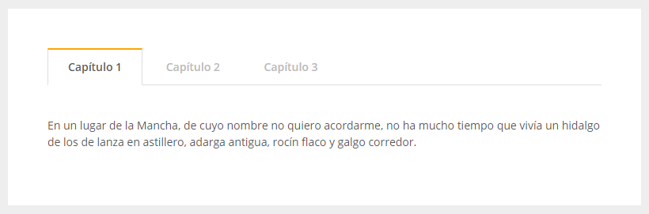

## Mejorar el uso accesible. navegación en pestañas

supongamos que tenemos el siguiene ejemplo: 

)

Y el código para producir este ejemplo sería. 

```html
<ul>
    <li><a href="#cap1">Capítulo 1</a></li>
    <li><a href="#cap2">Capítulo 2</a></li>
    <li><a href="#cap3">Capítulo 3</a></li>
</ul>a

<!-- contenidos -->
<section id="cap1">
    En un lugar de la Mancha ...
</section>
<section id="cap2">...</section>
<section id="cap3">...</section>
```

Cuando se pulsa en las pestañas, con Javascript no intrusivo y CSS, se muestra el contenido del capítulo correspondiene. Sin embargo, los productos de apoyo, no entenderán la verdadera función de la lista, ni su relación con las secciones. 

Para mejorar esto tenemos que: 

- Informar que la lista se comparta como un widget de pestañas y darle una eitqueta aria-label o aria-labelledby
- Luego, indicar que cada elemento de la lista cumple el rol de presentación de contenidos (role=presentation) para que anuncie su contenido pero no su rol nativo. 
- A los enlaces hay que añadirles varios atributos: 
    - Primero, cual es su rol (role=tabpane)
    - Haremos que pueda coger el foco con tabindex=0, para falicitar moverse con el teclado. 
    - Si el método utilizado para ocultar las pestañas solo las oculta visualmente, necesitaremos el atributo aria-hidden=true que indica que se oculte también al lector de pantalla, y este valor deberá cambiarse dinámicamente a través del Javascript que manipula el componente.
    - Por último, añadir el atributo aria-labelledby


## Ejemplo resuelto. 

```html
<ul role="tablist" aria-label="Capítulos del Quijote">
    <li role="presentation">
        <a href="#cap1" tabindex="0" role="tab" aria-controls="cap1" aria-selected="true" aria-posinset="1" aria-setsize="3">Capítulo 1</a></li>
    <li role="presentation">
        <a href="#cap2" tabindex="-1" role="tab" aria-controls="cap2" aria-posinset="2" aria-setsize="3">Capítulo 2</a></li>
    <li role="presentation">
        <a href="#cap3" tabindex="-1" role="tab" aria-controls="cap3" aria-posinset="2" aria-setsize="2">Capítulo 3</a></li>
</ul>

<!-- contenidos -->

<section id="cap1" role="tabpanel" tabindex="0" aria-labelledby="cap1">
En un lugar de la Mancha ...
</section>

<section id="cap2" role="tabpanel" tabindex="0" aria-labelledby="cap2" aria-hiden="true">
...
</section>
<section id="cap3" role="tabpanel" tabindex="0" aria-labelledby="cap3" aria-hidden=true>
...
</section>

```

Si nos fijamos, a los enlaces de las pestañas, se le ha puesto tabindex=0 al primero, mientras que a los otros -1. Esto se hace por la manera en la que deben comportarse las pestañas. Si en cada sitio web, las pestañas que comportasen de una forma diferente, los usuarios tendrían que aprender a manejar el teclado en cada uno de ellos. 

En el caso de las pestañas, una vez que coje el foco la primera, las demás ya no cojen el foco, y nos movemos por ellas con los cursores, y teclas de inicio y fin. Al pulsar espacio o enter en una pestaña tienes que activarla. 

A medida que el usuario selecciona las pestañas con las flechas, se va cambiando dinámicamente por Javascript el atributo tabindex=-1. Esto se denomina reving tabindex.


