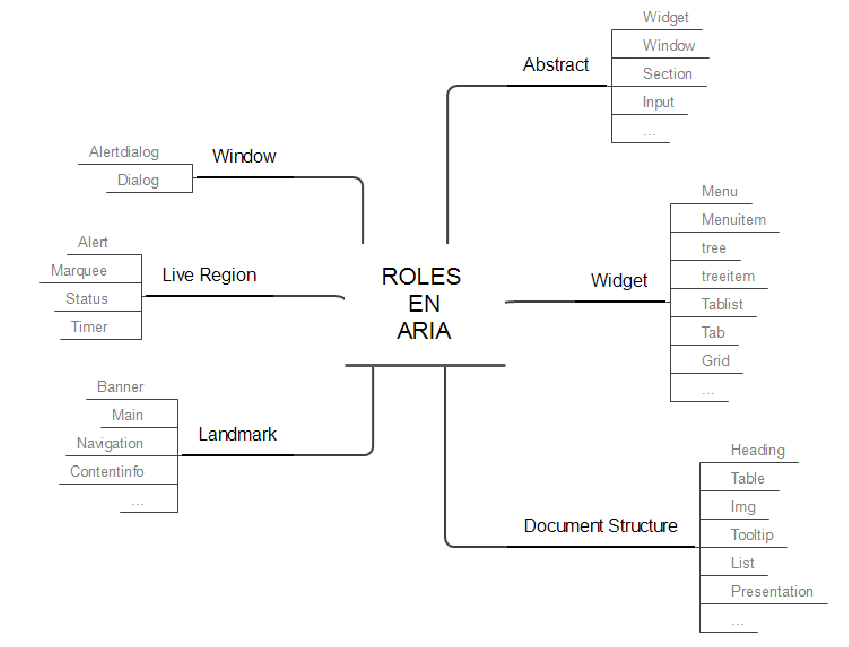
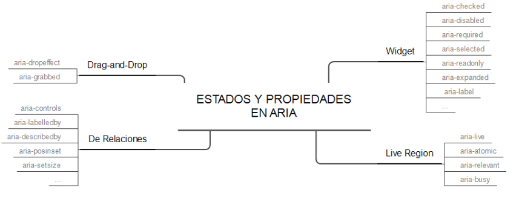

## Acesibilidad, diseño universal y usabilidad.

### Accesibilidad

La accesibilidad, aplicada al mundo de la tecnología, hace referencia al acceso universal a un contenido electrónico, típicamente, una página web, independientemente del tipo de hardware, software, infraestructura de red, idioma ,localización geográfica o capacidad de los usuarios.

Para poner en práctica la accesibilidad hay que tener presenta las Pautas de Accesibilidad al Contenido Web (WCAG) así como aplicar los Roles ARIA que se usan para hacer contenido accesible para las personas con diversidad funcional.

### Usabilidad

La usabilidad hace referencia a la facilidad de uso con que las personas pueden usar una herramienta en particual, en concreto podemos pensar también en una web. En hacer que el contenido sea fácil de utilizar.

Como una primera guía, podemos considerar que tenemos un problema de usabilidad cuando:

- Hay problemas para completar una tarea.
- Se saca al usuario del camino
- Algo produce confusión en los usuarios.
- Se producen errores.
- Los usuarios no ven algo que deberían haber visto.
- Los usuarios piensan que han finalizado una tarea y no es así
- No se entiende la navegación web.
- Se tienen dar muchísimos clics para llegar al objetivo.
- La página tarda mucho en cargarse.

Beneficios de la usabilidad:

- Facilidad de aprendizaje
- Disminuyen los costes de asistencia al usuario.
- Optimización de los costes de diseño, rediseño y mantenimiento.
- Aumenta la tasa de conversión.
- Para la usuarios es más fácil navegar.
- Mejora el prestigio de la web y la imagen de marca.
- Aumenta la velocidad de carga.

Existen 5 reglas principales para la usabilidad web:

- Rápido. Las páginas deben cargarse en una media de 4 segundos. Está comprobado que los usuarios esperan como máximo 10 segundos para ver el contenido solicitado
- Simple. Mantener una navegación simple. No forzar a aprender diversos caminos o esquemas de navegación.
- Investigable. Los motores de búsqueda buscan texto real, no prestan atención a animaciones o gráficos
- Universalidad. El código debe ser compatible con todos los navegadores. Utilizar HTML estándar.
- Mantener actualizado

Según Jakob Nielsen, uno de los gurús de la usabilidad más populares del mundo, las reglas para tener un diseño user fiendly son:

1. Visiblidad del estado del sistema. El sistema debe mantener informado al usuario sobre lo que está sucediendo. Son ejemplos básicos las barras de progreso, y los iconos de cargando.
2. Relación entre el sistema y el mundo real. El sistema debería hablar el lenguaje de los usuarios mediante palabras, frases y conceptos que sean familiares al usuario, más que con términos relacionados con el sistema.
3. Control y libertad del usuario. Es posible que los usuarios elegirán las funciones del sistema por error y necesitarán una “salida de emergencia” claramente marcada para dejar el estado no deseado al que accedieron, sin tener que pasar por una serie de pasos. Se deben apoyar las funciones de deshacer y rehacer
4. Consistencia y estándares. Los usuarios no deberían cuestionarse si acciones, situaciones o palabras diferentes significan en realidad la misma cosa. Mejor ser estándar que innovar.
5. Prevención de errores. Mucho mejor que hacer un buen diseño de mensajes de error, es realizar un diseño cuidadoso que prevenga la concurrencia de errores. El ejemplo más sencillo es el autocorrector del móvil (no solo te marca que hay un error, sino que te ofrece una corrección).
6. Reconocimiento antes que recuerdo. Se deben hacer visibles los objetos, acciones y opciones, El usuario no tendría que recordar la información que se le da en una parte del proceso, para seguir adelante. Las instrucciones para el uso del sistema deben estar a la vista o ser fácilmente recuperables cuando sea necesario.
7. Flexibilidad y eficiencia de uso. La presencia de aceleradores, que no son vistos por los usuarios novatos, puede ofrecer una interacción más rápida a los usuarios expertos que la que el sistema puede proveer a los usuarios de todo tipo. Se debe permitir que los usuarios adapte el sistema para usos frecuentes. Por ejemplo, el clásico botón de “Saltar” que aparece al instalar un juego es un buen ejemplo. El usuario “novato” verá el tutorial, y el que ya conozca la mecánica podrá saltarlo y empezar a jugar directamente.
8. Estética y diseño minimalista. Los diálogos no deben contener información que es irrelevante o poco usada. Cada unidad extra de información en un diálogo, compite con las unidades de información relevante y disminuye su visibilidad relativa. El buscador de Google es el máximo exponente de esto. Google.com consta de una barra de búsqueda, dos botones y una lupa.
9. Ayudar a los usuarios a reconocer, diagnosticar y recuperarse de errores. Los mensajes de error se deben entregar en un lenguaje claro y simple, indicando en forma precisa el problema y sugerir una solución constructiva al problema
10. Ayuda y documentación. Incluso en los casos en que el sistema pueda ser usado sin documentación, podría ser necesario ofrecer ayuda y documentación. Dicha información debería ser fácil de buscar, estar enfocada en las tareas del usuario, con una lista concreta de pasos a desarrollar y no ser demasiado extensa

En la actualidad hay que destacar que por ejemplo en web, gran parte de los usuarios nos visitarán desde dispositivos móviles. Es muy importante considerar la usabilidad cuando nos visitan con estos dispositivos.

### Diseño universal.

Es un concepto relativamente reciente y tiene que ver con el diseño de productos y entornos que resulten de fácil acceso para el mayor número de personas posible, sin necesidad de adaptarlos o rediseñarlos de forma especial. Es un término más global que engloba la accesibilidad

El Diseño Universal va más allá de la definición de accesibilidad, proponiendo siete principios tanto para espacios construidos como para productos o servicios que se ofrecen en la vida diaria y que, obviamente, deben estar disponibles para todos en igualdad de condiciones, teniendo en cuenta, también, el acceso a la información y las comunicaciones como parte de la integración e inclusión de personas con discapacidad.

Lo cierto es que, en un momento dado, todos podemos vernos perjudicados por las características del entorno por lo que la accesibilidad pensada, en principio, para personas con discapacidad, nos ayuda a todas las personas, haciendo los espacios más cómodos y seguros, por lo que podríamos hablar de “diseño para todos”, “diseños incluyentes” o “diseño universal”.

El diseño universal es definido como “el diseño de productos y entornos para ser usados por todas las personas, al máximo posible, sin adaptaciones o necesidades de un diseño especializados”.

Los siete principios del diseño universal:

- **Uso equitativo**.
- **Uso flexible**.Ha de ser usable por personas con un amplio rango de preferencias, hábitos y habilidades. Por ejemplo un packaging diseñado para baja visión y con etiqueta braille es universal, pero una máquina de vending táctil no parlante no lo es.
- **Uso simple e intuitivo**. Fácil de enteder por cualquier persona. Ejemplo, el sistema de pago sin contacto NFC y no es universal las máquinas expendedoras de tiques del metro (porque normalmente requieren de experiencia o mucha habilidad cognitiva).
- **Información Perceptible**. La información ha de poder ser percibida y entendida por todos en condiciones ambientales diversas y por parte de usuarios con distintas habilidades sensoriales. Por ejemplo, es universal el DVD de una película que contenga un canal con audio descripción para personas con dificultades de visión y con subtítulos para personas con diversidad funcional auditiva y no es universal un aviso de oferta que sólo se emite por el sistema de audio de un supermercado (porque no es recibido por personas que no oyen o que lo hacen con dificultad).
- **Tolerancia al error**. Ejemplos, es universal una máquina vending que tenga un botón claramente identificable para cancelar la operación.
  No es universal una lata de conservas que deja filos metálicos cortantes.
- **Mínimo esfuerzo físico**. Ejemplos, es universal un acceso por rampa mecánica a un primer piso de un centro comercial y no es universal una gran superficie que no disponga de espacios para el descanso.
- **Tamaño adecuado de aproximación y uso**. Ejemplos, es universal un MOSTRADOR de atención A DOBLE ALTURA (uno a 80 cm del suelo (con hueco bajo él) para personas de talla baja o que van en silla, y otro a 110 cm para personas que caminan) y no son universales las baldas de un lineal que están por encima de los 120 cm (porque una persona en silla de ruedas no alcanza con comodidad los productos).


## Accesibilidad por el W3C

Uno de los objetivos del W3C es guiar la web hacía su máximo potencial, lo cual incluye hacer una web más accesible para las personas, tengan o no cualquier tipo de discapacidad. De esta forma nace la WAI (Iniciativa de Accesibilidad Web), dentro de la cual podemos ubicar el grupo de trabajo PFWG (Group Work Formats Protocol), que a su vez son los autores de: 
- Las pautas de accesibilidad WCAG 2.0
- Directrices de accesiblidad para XML XAG
- Aplicaciones de Internet enriquecidas accesibles ARIA


### Pautas de Accesibilidad para el Contenido Web (WCAG)

Las pautas de accesibilidad para el contenido web son un conjunto de reglas, cuyo cumplimiento hace que nuestro sitio sea más accesible para las personas con diversidad funcional. Las pautas WCAG 2.0 se publicaron el 11 de diciembre de 2008 y las 2.1 el 5 de junio de 2018. Todos los criterios de 2.0 están incluídos en las 2.1. 
Tanto WCAG 2.0 como 2.1 son estándares actuales. WCAG 2.1 no deja WCAG 2.0 obsoleto ni lo sustituye. Desde W3C se anima a utilizar la versión más reciente al desarrollar o actualizar contenido
Para que una página sea compatible con la normativa WCAG 2.1, se deben satisfacer todos los requisitos de conformidad:

- Existen tres niveles de conformidad. Se debe cumplir con todos los requisitos de al menos un nivel.
  - Nivel A: Requisitos básicos para que algunos usuarios puedan utilizar los contenidos web.
  - Nivel AA: Mejor accesibilidad y eliminación de algunas barreras de acceso al contenido.
  - Nivel AAA: Mejoras
- Páginas completas. No se alcanza si partes de las páginas no cumplen.
- Procesos completos.
- Uso exclusivo.
- Sin interferencias.

Las pautas se pueden agrupar en cuatro principios
- Perceptible.
- Operable.
- Comprensible
- Robusto


De forma resumida:

1. Perceptible:
   - Se proporcionan ayudas textuales a todo contenido no textual de modo que se puedan convertir a otros formatos que las personas necesiten.
   - Se proporcionan alternativas para medios dependientes del tiempo (videos, sonidos, enlaces. )
   - Existe contenido que puede presentarse de diferente forma sin perder información o estructura
   - Se facilita a los usuarios ver y oír el contenido, incluyendo separación entre el primer plano y el fondo.
2. Manejable:
   - Se proporciona acceso a toda funcionalidad mediante el teclado.
   - Se proporciona tiempo suficiente para leer y usar el contenido.
   - No se diseña el conteido de forma que pueda provocar ataques, espasmos o convulsiones.
   - Se proporcionan medios para ayudar a los usuarios a navegar, encontrar contenido y determinar donde se encuentran.
3. Comprensible:
   - Los contenidos textuales resultan fáciles de leer y comprender.
   - Las páginas web aparecen y operan de forma predecible.
   - Se ayuda a los usuarios a corregir los errores.
4. Robusto:
   - Se maximiza la compatiblidad con las aplicaciones de usuario actuales y futuras, incluyendo las ayudas técnicas.


### Navegación accesible con roles WAI-ARIA (Accesible Rich Internet Application)


Segun la definición del W3C, aria es la forma de crear contenido web y aplicaciones web que sean accesibles para las personas con discapacidades. 

ARIA proporciona: 
1. Estructuras semánticas para las zonas funcionales
2. Mejora la navegación mediante teclado
3. Controles complejos (widgets) más accesibles.
4. Accesibilidad para el contenido actualizado de forma dinámica.

Se trata de hacerles la vida más fácil a usuarios que usan un lector de pantalla, estructurandndo la navegación a través del sitio web.
Para orientarse a través de un sitio web, los usuarios que usan lector de pantallas van pulsando diferentes teclas para navegar por la web: ir saltando por encabezados, listas, ojear imágenes, etc.

Con ARIA se pueden crear controles  complejos, como barras de progreso, deslizadores, desplegables, tooltipsflotantes, alertas, pop-hovercon opciones de diálogo, ordenación de listas de elementos, árboles de contenido contraíbles y desplegables, elementos sobre los que se puede hacer drag-and-drop. También se puede indicar la obligatoriedad de un campo de formulario o que este ha dado error de validación.

Para ello, ARIA cuenta con: 
- Roles. Su misión es definir que papel juegan los elementos dentro del documento (Ej, decir que es un slider)
- Estados y propiedades. Determinar las características y los valores de las propiedades. 

```html
<div id="slider" role="slider" aria-valuenow="27">
</div>
```

Con ARIA puedes definir áreas de contenido que se actulizan sin intervención del usuario (como un reloj que nos indique cuanto tiempo nos queda) de tl forma que las actualizaciones le pasen desapercibidas al usuario que no puede verlas. 

ARIA también permite definir accesibilidad para contenidos SVG.

Se puede utilizar tanto en HTML5, HTML4 y XHTML, solo que en éstos dos últimos, sino quieres que el validador del W3C de un error, deberás utilizar un DOCTYPE específico
```html
<!-- En XHTML:  -->
<!DOCTYPE html PUBLIC "-//W3C//DTD XHTML+ARIA 1.0//EN" "http://www.w3.org/WAI/ARIA/schemata/xhtml-aria-1.dtd">  
<!-- En HTML 4:  -->
<!DOCTYPE HTML PUBLIC "-//W3C//DTD HTML+ARIA 1.0//EN" "http://www.w3.org/WAI/ARIA/schemata/html4-aria-1.dtd">
```

Veamos un ejemplo simple:

Supongmos un formulario web, donde queremos sustutuír el botón de envir el formulario por una imagen. Algo como lo siguiente

```html
<div> </div>
```

Estamos utilizando un div como se fuese una etiqueta button. Si usamos ARIA, podemos indicarle esta circunstancia al navegador, agregando:

```html
<div role="button"> </div>
```

A partir de este momento, el lector de pantalla lo va a ver como un botón, lo anuncia como un botón, lo incluye como un elemento del formulario e incluso le asocia la tecla de acceso rápido asociada a los botones, habitualmente la b.

Sin embargo, falta asociarle el comportamiento de enviar, lo cual lo podemos hacer con Javascript no intrusivo, por ejemplo con el evento onclick. Pero, el hecho de tener un evento onlick, no hace que este elemento pueda recibir el foco a través del teclado (con la tecla tabulador), lo cual es importante para los usuarios que se manejan con el teclado. Para conseguir esto, deberemos añadirle el atributo tabindex, consiguiendo así tanto recibir el foco, como poder enviar usando la tecla ENTER. 

```html
<div role="button" tabindex="0" id="buttonEnviar">
   
</div>
```

Con todo esto, tendríamos el comportamiento equivalente. Sin embargo, este tipo de contrucción no está recomendado. ARIA no está pensado para que hagamos pasar unos elementos como otros. Los casos en los que se recomienda usar aria son: 
- La característica no está disponible en HTML
- La característica está disponible en HTML pero no implementada en los agentes de usuario. 
- La característica está disponible e implementada, pero el agente de usuario no proporciona el sorpote para la accesibilidad de ese elemento.
- El diseño visual "obliga" a determinado estilo, pero no podríamos decorar un elemento nativo con ese diseño  visual. 


#### Roles

Los roles sirven para especificar la función de un elemento. Para utilizarlo, es tan sencillo como añadir una propiedad al elemento role="[nombre_rol]".




Tipos: 
- Abstract: widget, window, section, input, etc. No se usan en el contenido, sino para definir dentro de la ontología tipos de roles generales. 
- Widget: menu, menitem, tree, treeitem, tablist, tab, tabpanel, button, grid, etc. 
- Document structure. heading, table, img, tooltip, list, presentation. No suelen ser interactivos. 
- Landmark. Permiten definir las grandes zonas de la página igual que las etiquetas semátnicas de HTML5 (header, main, nav, footer). Los usuarios de lectores de pantalla tienen atajos para saltar de zona en zonao sacar un árbol de la estructura de la página generado a partir de esta información. 
- Live region. alert, log, marquee, status y timer. Definen la función de las zonas vivas de la página, es decir, que cambian automáticamente sin intervención del usuario.
- Window: alertdialog y dialog. Para capas que abrimos a modo de ventanas.


Los landmark roles son:

- **banner**: zona del logo y título de la página. Debería haber solo uno por página. En html se puede asimilar a header
- **complementary**: zona complementaria,  por ejemplo artículos relacionados. En HTML5 sería un aside
- **contentinfo**: zona de información sobre el documento, normalmente el pié de página. 1 por página. En HTML5 footer
- **form**
- **main**. Solo uno por página
- **navigation**. Se pueden tener varios. En HTML5 nav
- **search**. No hay un elemento en HTML5, así que se haría con un form
- **application** (eliminado de los Landmark Roles en ARIA 1.1, que pasa a ser un rol de estructura)
- **region** (añadido en los Landmark Roles en ARIA 1.1)


Los otros elementos, son de interfaz (roles para widgets). Para verlo mejor, veamos un ejemplo, los problemas que tiene y las soluciones que aporta ARIA: 

Pensemos en un slider, que se puede situar en 3 posiciones: fácil, normal o difícil (valores 1, 2 y 3). El código podría ser algo como : 

```html
<div id="slider-background" title="nivel">
	<div id="slider-pointer">
		
	</div>
</div>
```

Para una persona sin discapacidad su uso es trivial, pero para una que utilice un lector de pantalla, el lector no sabe que tipod e elemento es (el ve un div), ni puede acceder a el (los divs no son accesibles por teclado), no se sabe el estado actual, ni que posibles valores puede tomar. En el siguiente ejemplo vemos un slider accesible con ARIA: 

```html
<p id="slider-description">Puede usar las teclas derecha/izquierda para cambiar el nivel.</p> 
<span id="slider-label">Nivel:</span> 
<div id="slider-rail">
	<button id="slider-handler" role="slider" aria-labelledby="slider-label" aria-describedby="slider-description" aria-valuemin="1" aria-valuemax="3" aria-valuenow="2"></button>
</div>

```

#### Navegación con el teclado

Podemos establecer la navegación con el teclado mediante el atributo tabindex, pero hay que tener en cuenta que los únicos elementos capaces de recibir el foco son : a, area, button, input, object, select y textarea. 

Con tabindex y un número, podemos indicar el órden. Si queremos excluír algén elemento, podemos indicar tabindex=-1


#### Estados y propiedades

Además de los roles, ARIA define los estados y propiedades de los diversos controles. La diferencia conceptual entre "estado" y "propiedad" es muy sutil: las propiedades suelen cambiar menos (aunque no siempre) que los estados, que cambian con frecuencia debido a la interacción del usuario. 

Pero en la práctica no es necesario diferenciarlos y todos ellos comenzarán por aria-. 

Hay 48 estados y propiedades y se dividen en cuatro categorías: 



- Atributos de Widget: aria-checked, aria-disabled, aria-required, aria-selected, aria-readonly, aria-expanded, aria-label, etc.
- Atributos de Live Region: aria-live, aria-atomic, aria-relevant y aria-busy que permiten definir cuándo se anunciarán al usuario de producto de apoyo los cambios producidos en las zonas que se actualizan solas, qué parte se anunciará, qué tipo de actualización queremos que se anuncie o si queremos que temporalmente dejen de anunciarse.
- Atributos de Drag-and-Drop:  aria-dropeffect y aria-grabbed
- Atributos de relaciones: es decir, que expresan relaciones o asociaciones entre los elementos  que  no  se  pueden  determinar  fácilmente a  partir  de  la  estructura  del documento: aria-controls, aria-labelledby, aria-describedby, aria-posinset, aria-setsize, etc.

Los estados y propiedaes pueden modificarse con Javascript, de hecho es recomendable hacerlo para interactuar con el usuario. 

Alguanas de las propiedades pueden aplicarse a todos los elementos: 

- aria-label: Con este atributo indicamos directamente el contenido de la etiqueta del atributo: Ej.

```html
<button aria-label="Cerrar">X</button>
```
Es importante saber que este atributo anula la etiqueta nativa, de forma que un lector para el ejemplo anterior leería botón cerra, y no botón X. En este caso es justamente lo que queremos.

- aria-labelledby y  
- aria-describedby.


#### Actualizaciones dinámicas de contenido. 

ARIA denomina "regiones activas" a los elementos/zonas que pueden presentar actualizaciones por ajax y cuenta con la propiedad aria-live para indicar el valor de intrusismo: 

- off
- polite
- assertive
- rude


#### Etiquetas Aria-label

Con ello ponemos una etiqueta dentro del elemento con un atributo

https://olgacarreras.blogspot.com/2017/12/novedades-wai-aria-11.html
https://olgacarreras.blogspot.com/2007/09/wai-aria-introduccion-referencias.html
https://www.usableyaccesible.com/servicios.php
https://olgacarreras.blogspot.com/2014/03/navegacion-mas-accesible-y-semantica-en.html
http://www.nosolousabilidad.com/articulos/wai_aria.htm


## Bibliografía

Web: https://www.mcarmendealba.com/accesibilidad-y-usabilidad-diferencias/
Web: https://olgacarreras.blogspot.com/
Web: http://accesibilidadweb.dlsi.ua.es/?menu=pautas-accesibilidad-contenido-web
Web: http://itakora.com

Buscando
