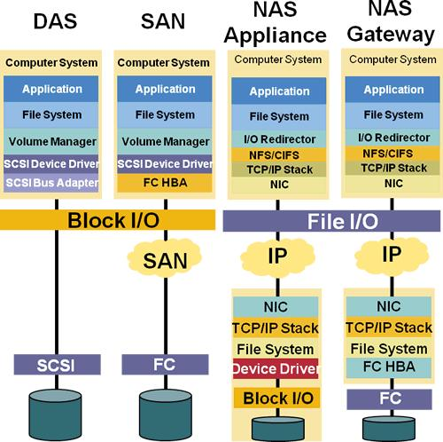
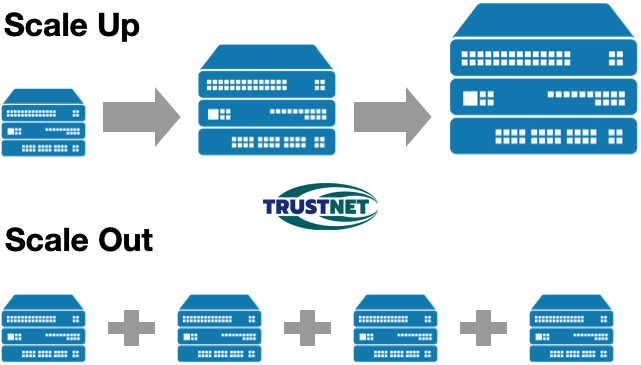

# Sistemas de Almacenamiento.

Las necesidades de almacenamiento profesional han dado lugar a muy diferentes soluciones: DAS, NAS, SAN, CLOUD, …

## DAS (Direct_Attached Storage). 
Es el método de almacenamiento tradicional. Consiste en conectar directamente el medio de almacenamiento al ordenador o servidor. Su principal desventaja, que no puede ser compartido por otros equipos. En este caso el Sistema Operativo accede al almacenamiento mediante bloques, es decir, mediante comando SCSI con los que consigue bloques de datos en formato bruto. Es el sistema operativo el encargado de poner en ese disco particiones y sistemas de ficheros para poder almacenar carpetas o ficheros en el. 

## NAS (Network-Attached Storage). 
Almacenamiento al que se accede a través de una red. En este tipo de almacenamiento, se comparten ficheros, no bloques. La caja negra se encarga de todo (particionar, formatear, compartir, etc. ). 

## Clustered NAS.
 Es una versión mejorada del NAS y se basa en la disponibilidad de varios servidores que comparten los mismos volúmenes, permitiendo un mejor reparto de la carga e trabajo, y el añadido de disponer de más interfaces de comunicación. 

## SAN (Storage Area Network).
 Es un almacenamiento en el que los equipos tienen la capacidad de leer y escribir directamente sobre el volumen compartido, como si fuera un almacenamiento local. Por otro lado, su conexión por Fibre Channel le aporta mucha menor latencia y un mejor promedio de ancho de banda sostenido. Varios servidores dispondrán de adaptadores para acceso a la SAN (HBA’s) mediante SWITCHES especializados, para llegar a sistemas de almacenamiento complejos.
 Los sistemas SAN suelen ser modulares y manejan gran cantidad de discos. Las controladoras son super controladores con grandes cantidades de memoria caché y múltiples tipos de conectividades, que generan pools de datos repartidos por los discos físicos, con protección RAID. 
En los últimos tiempos un protocolo ha irrumpido fuerte con el fin de abaratar los costes de una infraestructura SAN. Se trata de ISCSI, que no es más que empaquetar los comandos SCSI, en la pila TCP/IP clásica, en concreto por un puerto TCP. De esta forma se puede aprovechar adquirir de forma mucho más barata la parte de hardware de red, ya que se utilizan switches ethernet estándar y tarjetas de red estándar. 
La principal diferencia entre un NAS y una SAN es que la SAN sirve los datos a bajo nivel a través de protocolos SCSI, con tecnologías como fibre channel o Iscsi. Los equipos conectados a la SAN no solicitan los ficheros sino que están conectados a bajo nivel y solicitan el bloque concreto de un determinado disco. La máquina local conectada a la SAN verá el almacenamiento como un disco conectado a la máquina, y no como una unidad de red. 

Cloud. Al almacenamiento se accede a través de una conexión Internet o IP 

## Virtualización del Almacenamiento. 
También denominado Almacenamiento definido por software (SDS). 
La virtualización de servidores está ampliamente extendida, y a día de hoy es poco común el desplegar sobre un servidor físico. Las ventajas de la virtualización son el ahorro de costos, mejoras en backup, tiempos de parada mínimos, etc. Una vez que tenemos definida la virtualización del hardware, se presenta un nuevo problema, el almacenamiento. El sitio donde almacenamos nuestras máquinas virtuales y sus datos pasa a ser un sitio crítico. Ya no basta con tener un RAID del tipo que sea, necesitamos que la respuesta sea rápida, que podamos hacer backup y restauraciones rápidas, estar protegidos frente a caídas del sistema. En definitiva, asegurar el servicio y la continuidad del negocio. La solución es la virtualización del almacenamiento, para no depender directamente de los elementos hardware y a ser posibles, tampoco depender de un único fabricante. 
Existen soluciones hardware y soluciones software para la virtualización del almacenamiento: 
Soluciones hardware. 
Como soluciones hardware hablamos de fabricantes de hardware de almacenamiento. Todos tienen sistemas interesantes pensando exclusivamente en optimizar la solución para su hardware. Algunos fabricantes son capaces de gestionar hardware de otros fabricantes generalmente cabinas conectadas por fibra. 
Las soluciones hardware orientadas a empresas son: 
IBM 
Se llama SVC (San Volume Controller), y es básicamente dos servidores IBM con una versión propia de Linux. Estos servidores son los encargados de la virtualización del almacenamiento y por debajo gestionar varios modelos de cabinas y almacenamientos FLASH de IBM conectados por fibra. 
La gestión se realiza principalmente desde una interfaz web
HP.
…

Soluciones Software 
VMware vSAN.
Como no podía ser de otra forma, el líder en virtualización de servidores sacó su propia solución para la virtualización de almacenamiento vSAN. 
vSAN es un producto interesante que se integra muy bien con VMware, pero tiene algunas pegas. Requiere al menos un SSD en cada servidor, ya que lo utiliza para la caché de lectura/escritura, y se requieren al menos 3 host 's para soluciones de alta disponibilidad. Además se licencia por socket y no por servidor. 
DataCore. 
Funciona sobre servidores Windows, ya que es el Sistema Operativo que tiene mejor compatibilidad con drivers. Admite todo tipo de almacenamiento que le puedas conectar a un servidor (FC, TCoE, Iscsi, SAS, SATA, SCSI, IDE o USB). 
DataCore puede servir disco por fibra o por iSCSI. También se puede configurar como NAS con windows y servir disco por CIFS o NFS. 
La configuración clásica es con dos nodos, que funcionan en mirror

## Arquitectura Scale Out

El escalamiento Scale-Up frente al escalamiento Scale-Out es una comparación que ilustra la evolución de la tecnología de almacenamiento. ¿Cuál es la diferencia?

El criterio de almacenamiento más importante es lo que sucede cuando se necesita agregar capacidad.

La posibilidad de agregar capacidad mantiene a los administradores de almacenamiento despiertos por la noche. Cuando se queda sin capacidad, sus opciones pueden ser tan simples como agregar un nuevo gabinete de unidades o tan complejas como construir un nuevo centro de datos. Obviamente, mientras más simple, es mejor y la diferencia en arquitectura clave que impulsa la simplicidad es, si el diseño de su sistema es Scale-Up o Scale-Out.

La arquitectura «Scale-Up» ha sido un estándar de almacenamiento durante mucho tiempo, sin embargo, a medida que aumenta el volumen de datos, se hace cada vez más difícil ignorar las muchas limitaciones y fallas del almacenamiento vertical (Scale-Up). La solución puede ser la arquitectura «Scale-Out».

Scale-Up es la forma más común de crecimiento de las plataformas tradicionales de almacenamiento (archivos y bloques). El sistema consta de un par de controladores/procesadoras y múltiples gabinetes de unidades de disco. Cuando se queda sin espacio, agrega otro estante de unidades con discos duros. Esta arquitectura de escalamiento es dependiente de los límites de escalabilidad de los controladores de almacenamiento.

Una vez que se alcanzan los límites de rendimiento y/o capacidad de los controladores de almacenamiento, entonces la única opción es agregar un nuevo sistema para ubicarse junto al existente. En este punto, su carga de trabajo aumenta a medida que migra el almacenamiento y administra la carga entre los dos silos de almacenamiento independientes que ahora existen.

A medida que crece el volumen de datos de una organización, se deben agregar sistemas completamente nuevos para hacer frente a las demandas adicionales. En última instancia, esta arquitectura se vuelve altamente compleja de administrar. La asignación ineficiente de recursos se convierte en un problema para decidir dónde deben residir las cargas de trabajo.

**El crecimiento Scale-Out significa una mejor escalabilidad**

En el sistema de almacenamiento Scale-Out es simple agregar más nodos al clúster, el software de almacenamiento incluye los nuevos nodos en el clúster y redistribuye los datos a través de estos nodos. Por cada nuevo nodo agregado, agrega no solo capacidad de almacenamiento de disco adicional (y rendimiento) sino también RAM, CPU y recursos de red adicionales para mejorar el rendimiento general del clúster. Este método de escalado evita las limitaciones de la arquitectura de almacenamiento de escalamiento tradicional (Scale-Up) donde cada IO debe ser procesado por uno de los dos únicos controladores de almacenamiento y solo se puede crecer en capacidad, más no en performance.

Pasando a una arquitectura Multi-Data Center, el clúster puede ampliarse agregando nodos en diferentes áreas geográficas y debido a que el almacenamiento puede ser geográfico, se pueden establecer políticas para distribuir datos en estas otras ubicaciones. A medida que un usuario accede al almacenamiento, el sistema devolverá datos del nodo que proporciona el mejor tiempo de respuesta para el usuario, ya sea desde un centro de datos en México, Londres o un centro de datos en Nueva York. Por lo tanto, un usuario en Nueva York esperaría obtener un acceso más rápido a un objeto de datos desde la copia almacenada en el centro de datos de Nueva York que la copia en Londres. Del mismo modo, para un usuario que accede al mismo conjunto de datos en Londres, lo que es clave, es poder mantener la consistencia de los datos entre las ubicaciones, de modo que se devuelvan los mismos datos independientemente de la ubicación.

Dado que las necesidades de almacenamiento de datos crecen rápidamente en los próximos años, es importante considerar avanzar hacia arquitecturas de almacenamiento Scale-Out frente a Scale-Up. La escalabilidad que ofrece el almacenamiento Scale-Out ayudará a mitigar los costos, la complejidad y la asignación de recursos.