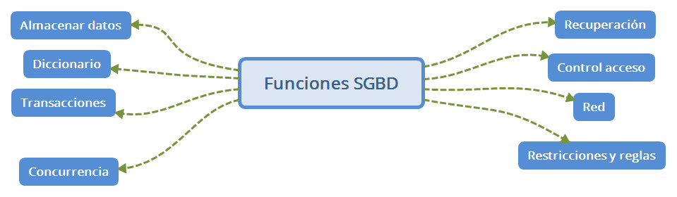

# Bases de datos

## Introducción 

Tradicionalmente los sistemas de información de las empresas se componían de programas escritos en lenguajes de alto nivel (C, fortran, ...) que gestionaban información almacenada en ficheros, de forma que el programador esta el responsable de almacenar y recuperar la información. Esto supone varios problemas: 

- Por un lado los programadores estan escribiendo una y otra vez código para realizar las mismas operaciones, y posiblemente no todos de una forma correcta. 
- Además no estamos controlando si varios programas están accediendo a los ficherso de forma concurrente. 
- El hecho de que un mismo fichero necesite ser abierto por varios programas, si tenemos que hacer un cambio en el fichero, por ejemplo para añadir un dato a los registros, esto nos obligará a reescribir todos los programas que utilizan ese fichero. 
- Si para evitar estos problemas, cada aplicación tiene sus propios ficheros, entonces tenemos redundancia de datos, lo cual es un despilfarro de recursos, pero además puede suponer tener información inconsistente. 
- Y además existen otros posibles problemas como recuperación frente a fallos, control de acceso a los datos, etc. 

Por todo esto se buscó un nuevo enfoque, que se trató de independizar los datos de las aplicaciones que los utilizan, de modo que ningun cambio en la estructura de los datos afecte a los programas que los utilizan. De esta forma podemos definir una base de datos como un conjunto de datos interrelacionados y almacenados, que sirven a aplicaciones de la menor manera posible, pero manteniendo una independencia entre datos y programas. 

Las bases de datos han de dar a los usuarios (entendemos que un programa que la utilzia es un usuario) métodos para definir los datos que van a utilizar, para instroducir datos, para modificarlos y borrarlos. También buscan otro sservicios como control de acceso, recuperación ante fallos, acceso concurrente, rendimiendo óptimo, poder realizar operaciones atómicas. 

Un Sistema Gestor de Bases de Datos es un conjunto de programas que permiten administrar y gestionar la información de una base de datos. 

## Arquitectura. Niveles

en 1975 el comité ANSI-SPARC propuso una arquitectura de tres nivles para los sitemas gestires de bases de datos, cuyo principal objetivo era separar los programas de aplicación de la base de dato física. Estos niveles son: 

- Nivel interno o físico. Se trata del nivel más cercano al almacenamiento. En el se describe como están almacenados los datos en el ordenador. Arquivos que contienen la información, organización, métodos de acceso a los registros, etc.
- Nivel externo o de visión. Se trata del nivel más cercano a los usuarios. En el se describen varios esquemas o vistas de usuarios. Cada esquema define a parte de la base de datos que interesa a ese grupo de usuarios. 
- Nivel conceptual. Describe la estructura de toda la base de datos. Este nivel describe las entidades, atributos, relaciones, operaciones de los usuarios, restricciones, etc. 

## Definiciones. 

Llamamos LDM al lenguaje de manipulación de datos. Este lenguaje nos permite realizar consultas, insertar registros, eleminar, actulaizar. Sus instrucciones: 
INSERT
DELETE
UPDATE

El otro lenguaje es el LDD. El lenguaje de definición de datos. Sus sentencias: 
CREATE
ALTER
DROP
TRUNCATE

Por último, tenemos un tercer lenguaje denominado LCD (Lenguaje de control de datos). Al igual que con el LDD, este lenguaje es utilizado por el administrador de bases de datos. contiene comandos para administrar el control de los usuarios que podrán hacer uso de la base de datos
GRANT
REVOKE

## Funciones de una base de datos. 
Edgar Frank Cood, el creador del modelo relacionar estableció una serie de servicios que debe cumplir todo Sistema Gestor de Bases de Datos: 

- El principal servicio es propocionar al usuario la **capacidad de almacenar datos** en la base de datos, acceder a ellos y actualizarlos. Esta es la función principal. Además debe hacerlo ocultando la estructura física interna (archivos que halla por debajo. ) 
- Se debe proporcionar al usuario un catálogo en el que se almacenen las descripciones de los datos. Se llama el diccionario de datos. 
- Se debe proporcionar un mecanismo que garantice que todas las actualizaciones correspondientes a una determinada transacción se realicen todas o no se realice ninguna. 
- Se debe proporcionar un mecanismo que se asegure que la base de datos se actualiza correctamente cuando varios usuarios hacen cambios de forma simultánea. El acceso concurrente es uno de los principales objetivos de los SGBD
- Se debe proporcionar algun mecanismo capaz de recuperar la base de datos en caso de que ocurra algún suceso que la dañe.
- Se debe proporcionar un mecanismo que garantice que solo los usuarios autorizados puedan acceder a la base de datos. 
- El SBGD debe ser capaz de integrase con algún software de comunicación. En muchas ocasiones los usaurios se conectan con terminales remotos a través de una red. Todas estas comunicaciones las maneja el gestor de comunicaciones de datos, que si bien puedo no formar parte del SGBD, debe integrarse con él. 
- Se debe proporcionar medios para garantizar que tanto los datos, como los cambios que se realizan sobre ellos sigan ciertas reglas. La integridad se ocupa de la calidad de los datos. Norlamente se expresa mediante restricciones

## Componentes

Los compoentes de una base de datos son los encargados de realizar las funcionanes de ésta: 

- Lenguajes de datos.
- Diccionario de datos.
- Objetos.
- Herramientas de administración. 
- Optimizador de consultas. 
- Gestor de trasacciones.
- Planificador. 
- Copias de seguridad.

### Lenguajes de datos.

Hay 3+1 tipos de lenguaje según su funcionalidad: 
- DDL Lenguaje de definición de datos. CREATE, DROP, ...
- DCL Lenguaje de control de datos. GRANT
- DML Lenguaje de maniputación de datos. SELECT INSERT, UPDATE, DELETE
- Lenguajes de cuarta generación, diseñados con el objetivo de diseñar aplicaciones dentro de la propia BBDD

### Diccionario. 

El diccionario está compuesto opr el conjutno de esquemas que describen el contenido del SGBD, incluyendo los distintos objetos y sus propiedades: 

- Nombre, tipo y tamaño
- Relaciones entre datos
- Restricciones de integridad
- Usuarios autorizados
- Estadísticas de utilización. 

El diccionario es accesible por los usuarios. 

### Objetos. 

Todos los gestores poseen una serie de objetos que permiten la definición y manipulacíon de los datos:
- Tablas base y vistas
- Consultas
- Dominios y tipos definidos de datos
- Resctricciones de tabla, dominio y aserciones. 
- Funciones y procedimientos almacenados. 
- Disparadores (triggers)

### Herramientas de administración. 

Todo sistema posee una serie de herramientas para cubrir las tareas de administración. 

### Optimizador de consultas. 

Este componente se encarga de deterinadr la estrategia más optima para la ejecución de una consulta. 

### Gestor de trasacciones. 

Una trasacción es un conjunto de operaciones que ha de ejecutarse de forma atómica (es decir, o se ejecutan todas las operaciones o no se ejecuta ninguna). Esto es muy importante para la interidad de los datos, y de esta parte se encarga este gestor. 

### Planificador (scheduler).

Parte del SGBD que se encarga de programar y automatizar la ejecución de tareas. 

### Copias de seguridad.

Módulos del SGBD:

- El **procesador de consultas** es el componente principal. Transforma las consultas en instrucciones de bajo nivel que se dirigen al gestor de la base de datos. 
- **Gestor de la base de datos**. Es la interfaz entre los programas de aplicación y las consultas de los usuarios. Acepta consultas y examino los esquemas externo y conceptual para determinar que registros re requieren para satisfacer la petición. Entonces el gestor de base de datos realizar una llamada al gestor de archivos para ejecutar la petición. 
- **Gestor de archivos**. Maneja los archivos en disco, donde se almacena la base de datos. No realiza la E/S de datos, sino que usa los métodos del Sistema Operativo. 
- **Preprocesador LDM**.  Convierte las sentencias del lenguaje LDM a funciones estándar escritas en el lenguaje anfitrión. 
- **Compilador LDD**. Convierte las instrucciones LDD en el conjunto de datos que contienen metadatos. Estas tablas se almacenan en el diccionario de datos

- Control de autorización. Este módulo comprueba que el usuario tiene los permisos necesarios para llevar a cabo la operación que solicita.
- Procesador de comandos. Una vez que el sistema ha comprobado los permisos del usuario, se pasa el control al procesador de comandos.
- Control de la integridad. Cuando una operación cambia los datos de la base de datos, este módulo debe comprobar que la operación a realizar satisface todas las restricciones de integridad necesarias.
- Optimizador de consultas. Este módulo determina la estrategia óptima para la ejecución de las consultas.
- Gestor de transacciones. Este módulo realiza el procesamiento de las transacciones.
- Planificador (scheduler). Este módulo es el responsable de asegurar que las operaciones que se realizan concurrentemente sobre la base de datos tienen lugar sin conflictos.
- Gestor de recuperación. Este módulo garantiza que la base de datos permanece en un estado consistente en caso de que se produzca algún fallo.
-Gestor de buffers. Este módulo es el responsable de transferir los datos entre memoria principal y los dispositivos de almacenamiento secundario. A este módulo también se le denomina gestor de datos.

## Breve Historia. 
Podríamos considerar el origen en Nueva York, año 1884. Aquí Herman Hollerith fué el creador de la máquina autoática de tarjetas perforadas. En aquella época los censos se realizan ba mano, y este ingeniero creo una máquina tabuladora o censadora basada en tarjetas perforadas. Durante los isguietnes 60 años, nadie avanzó hasta que en 1950 se diera el siguiente paso con las cintas magnéticas. Estas constituyen un nuevo medio de soporte, y con ellas se empezó a automatizar por fin la información. 
En los años 60 las computadoras comenzan a bajar de precio, a popularizarse y aparecen los discos, que permiten consultar información sin saber la ubicación exacta de los datos. Fué aquí donde aparecen las verdaderas primeras bases de datos de red (CODASYL) y las bases de datos jerárquicas (IMS). 
En los 70 Codd habla sobre las bases de datos relacionales y poco más tarde Larry Ellison desarrolla la base de datos Oracle siguiendo los postulados de Codd. 
En los 80, las bases de datos relacionales logran posicionarse en el mercado, y aparece el lenguaje SQL que ya en los 90 se impone como el lengauje de referencia para trabajar con bases de datos. 
http://conocelahistoria.com/c-tecnologia/historia-de-la-base-de-datos/
