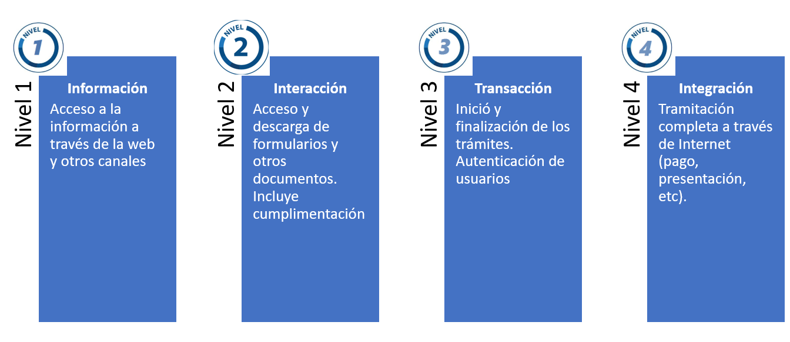

- [Administracion Electrónica](#administracion)
- [Sede Electrónica](#sede)
- [Identidad Electrónica](#eidentidad)
- [DNI Electrónico](#dnie)
---

## Administración Electronica 

La administración electrónica es la aplicación de las tecnologías de la información y las comunicaciones en la administración pública. Al implementarla, se conseguirían dos cosas, por un lado mejorar de la organización, conviertiendo los procesos en papel por procesos electrónicos que permiten reducir mucho todo el trabajo. Por otro lado se ofrece al ciudadano una nueva forma de interactuar con la administración, cómodamente, desde su casa, sin horarios, sin colas, sin desplazamientos y más rápido. 

La definición oficial dada por la Comisión Europea de la Unión Europea es "Administración Electrónica es el uso de las Tecnologías de la Información y las Comunicaciones en las Administraciones Públicas, Combinado con cambios organizativos y nuevas aptitudes, con el fin de mejorar los servicios públicos y los procesos democráticos y reforzar el apoyo a las políticas públicas. 

Los objetivos son: 
- Mejora de los servicios públicos. 
- Mejora de las políticas públicas. 
- Mejora de los procesos democráticos. 

Medios para alcanzarlos: 
- Uso de las TIC. 
- Cambios organizativos. 
- Adquisición de nuevas habilidades. 

La administración electrónica ofrece una serie de ventajas, tanto para el usuario final como para la propia administración: 

Ventajas usuarios: 
- Posibilidad de realizar támites en cualquier momento y sin necesidad de desplazarse. 
- Posiblidad de acceder al estado de tramitación del procedimiento. 
- Acceso permanente a la información institucional. 
- Mejora la eficacia y la eficiencia, al reducir al reducirse trámites innecesarios y eliminar la presentación de determinados documentos. 
- Fomento de la interacción del usuario con la Administración (quejas, sugerencias, buzón, ...)
- Mejora la gestión documental, evitando que los papeles se pierdan, y facilitando del acceso a los documentos. 

Ventajas para la administración: 
- Mejora la atención a los usuarios, lo que redunda en mejor imágen. 
- Reducción de costes. Papel, sitio para almacenar, 
- Ahorro de tiempo y mejora la productividad. 
- Mejora permanente de los procesos, por estar sometidos a revisión periódica. 
- Optimización de recursos humanos. 

Barreras iniciales para implantar: 
- Alto coste económico inicial, que luego será amortizado a medio/largo plazo.
- Importante desarrollo normativo inicial.
- Miedo al cambio. 
- Sensación de pérdida de control de los procedimientos (al ser automáticos muchos).

### Referencias normativas. 
Ley 30/1992, de 26 de noviembre, de Régimen Jurídico de las Administraciones Públicas y del Procedimiento Administrativo Común, incluye una previsión en cuanto a la incorporación de nuevas tecnologías. En su artículo 45, se introduce la posiblidad de que los ciudadanos se relacionen con las Administraciones Públicas.

La Ley Orgánica 15/1999, de Protección de Datos de Carácter Personal, desarrollada por el Real Decreto 1720/2007, del 21 de diciembre. Tiene especial relevancia en la medida que hace referencia a las cesiones y comunicaciones de datos personales y al peligro potencial del trabajo en un entorno web. 

La Ley 24/2001, del 27 de diciembre, de medidas fiscales, administrativas y del orden social, introduce varios preceptos que van a modificar sustancialemtne las relaciones de los ciudadanos con las administraciones públicas: los registros telemáticos, las notificaciones telemáticas y las certificaciones y transmisiones telemáticas. 

El Real Decreto 209/2003, por el que se regulan los registros y las notificaciones telemáticas, que, aunque de ámbito estatal, es aplicable supletoriamente a todas las administraciones. Dentro de este Real Declero, podemos señalas la regulación de: 
- Los registros telemáticos. 
- Las notificaciones telemáticas y los certificados telemáticos. 
- La dirección electrónica única (DEU), buzón gratuíto del que y apueden disponer los ciudadanos para recibir notificaciones telemáticas. 
- La utilización de medios telemáticos para la sustitución de la aportación de certificados por los ciudadanos.

Ley 59/2003, de 19 de diciembre, de firma electrónica. En esta norma, que supone ya un gran avance en materia de administración electrónica, se regula: 
- Los diferentes tipos de firma electrónica (general, avanzada y reconocida) y a sus respectivos requisitos y características de seguridad. 
- El concepto de documento electrónico. 
- El valor probatorio de cada tipo de documento electrónico. 
- El empleo de la firma electrónica por parte de las AAPP. 
- El DNI electrónico, que será desarrollado con posterioridad por el Real Decreto 1553/2005, del 23 de diciembre.

La Ley 56/2007, de 28 de diciembre, de Impulso de la Sociedad de la Información, que modifica la Ley 34/2002, de 11 de Julio, de Servicios de la Sociedad de la Información y de Comercio electrónico. Ambas normas regulan el régimen jurídico de los servicios de la sociedad de la información y de la contratación por vía electrónica. La ley 50/2007, además, tiene especial interés y aque incorpora el plan para implantar la factura electrónica de manera obligatoria y el uso de los medios electrónicos en los procesos de contratacio´n entre empresas y de estas con el sector público. En el caso de la Administración Pública hay que recordar que la Ley 30/2007, del 30 de octubre, de Contratos del Sector Público, prevé la obligatoriedad, en los términos, en los términos establecidos en la Ley y en su desarrollo, del uso de medios electrónicos, informáticos y telemáticos en la contratación pública. 

Sin embargo, la norma que finalmente establece el marco de actuación en materia de administración electrónica es la Ley 11/2007, de 22 de junio, de acceso electrónico de los ciudadanos a los servicios públicos, en la que se reconoce el derecho de los ciudadanos a relacionarse con las administraciones públicas por medios electrónicos. 

Esta ley supone una regulación más exhaustiva y sistemática que la que hay hasta ahora. Hay que destacar su carácter de legislación básica en muchos de sus preceptos, el reconocmimiento de derechos, y la incorporación de cierta flexibilidad que facilita la implantación de la e-administración, como la autenticación o los sellos de órgano o entidad. 
La ley está centrada en los ciudadanos y establece una relación de sus derechos y unas obligaciones de las administraciones públicas respecto a los mismos. Además, la ley regula otros aspectos com ola utilización de las tecnologías de la información en la actividad administrativia y en las relaciones entre las administraciones públicas. Dentro de los derechos se reconoce la Ley a los ciudadanos, podemos destacar: 

- A utilizar medios electrónicos para obtener información, realizar consultas, manifestar consentimiento, entablar pretensiones, efectuar pagos, realizar transacciones y oponerse a las resoluciones y actos administrativos. 
- A elegir el canal de relación entre los dispositivos. 
- A no aportar documentos o datos que obren y aen la administración, pero no sólo a la administración ante la que van a actuar, lo que requiere el desarrollo de plataformas tecnológicas con el fin de asegurar la interoperabilidad.
- A la igualdad en el acceso electrónico. 
- A conocer por medios electrónicos el estado de la tramitación de los procedimientos realizados en los que sean interesados. 
- A obtener copias electrónicas de los documentos electrónicos que formen parte de procedimientos de los que sean interesados. 
- A obtener los medios de identificación electrónica necesarios, pudiendo utilizar el DNI electrónico en todo caso, además  de otros sistemas de firma electrónica admitidos. 
- A la calidad de los servicios públicos prestados por medios electrónicos, ofreciendo las debidas garantías de seguridad. 
- A que la administración conserve electrónica de documentos que formen parte de un expediente, lo que implica el desarrollo del archivo electrónico. 
- A formular alegaciones y aportar documentos por medio de registros electrónicos (que obligará a tener registros electrónicos yu a realizar notificaciones electrónicas).
- A obtener información por medios electrónicos.

A partir de la entrada en vigor de la Ley 11/2007, se han sucedido una serie de normas que han venido a desarrollar sus contenidos, a las que, con toda seguridad, se incorporarán otras nuevas: 

El Real Decreto 1671/2009, de 6 de noviembre, por el que se desarrolla parcialmente la Ley 11/2007. En esta norma se regulan de una forma más concreta distintos preceptos que aparecen en la Ley 11/2007, entre los que podemos destacar: 
- Se especifican las vías de actuación para asegurar el derecho de no aportación de documentos.
- Se detallan los requisitos y contenidos de la sede electrónica, sellos electrónicos, etc. 
- Se establece el régimen de habilitaciones de personas físicas y jurídicas. 
- Se detallan los requisitos y contenidos del registro electrónico. 
- Se regulan las notificaciones electrónicas. 
- Se detallan los requisitos y características de los documentos electrónicos, expedientes electrónicos, archivo electrónico, etc. 

El Real Decreto 3/2010, de 8 de enero, por el que se regula el Esquema Nacional de Seguridad en el ámbito de la administración electrónica. Esta norma aborda uno de los aspectos más delicados en materia de la seguridad en la utilización de los medios electrónicos. En ella se establecen por un lado, los principios básicos que deben regir los sistemas de seguridad, tales como la seguridad integral, gestión de riesgos, prevención, reevaluación, etc. y por otro lado, los requisitos mínimos que deben alcanzar estos sistemas, de manera que permitan una protección adecuada de la información y los servicios. 

La finalidad del Esquema Nacional de Seguridad es la creación de las condiciones necesarias de confianza de los usuarios en el uso de los medios electrónicos, a través de medidas para garantizar la seguridad de los sistemas, los datos, las comunicaciones, y los servicios electrónicos. 

El Real Decreto 4/2010, de 8 de enero, por el que se regula el Esquema Nacional de Interoperabilidad en el ámbito de la admnistración electrónica. Esta norma viene a dar respuestaa lo establecido en el art. 42.1 de la Ley 11/2007, y establece los criterios, recomendaciones y principios específicos necesarios que van a permitir el desarrollo de la interoperabilidad en las Administraciones públicas, desde una perspectiva global. 

La finalidad del Esquema Nacional de Interoperabilidad es la creación de las condiciones necesarias para garantizar el adecuado nivel de interoperabilidad técnica, semántica y organizativa de los sistemas y aplicaciones empleados por las Administraciones públicas, que permita el ejercicio de derechos y el cumplimiento de los deberes a través del acceso electrónico a los servicios públicos. 

### Otras normativas relevantes
Orden PRE/1551/2003, de 10 de junio, po la que se desarrolla la disposición primera del Real Decreto 209/2003, de 21 de febrero, que regula los registros y las notificaciones telematicas, así como la utilización de medios telemáticos para la sustitución de certificados por los ciudadanos. 

Real Decreto 1553/2005, de 23 de diciembre, por el que se regula el DNIe y sus certificados de firma electrónica.

Real Decreto 522/2006, del 28 de abril, por el que se suprime la aportación de fotocopias de documentos de identidad en los procedimientos administrativos de la Administración General del Estado y de sus organismos públicos vinculados o dependientes.

Ley 25/2007, de 18 de octubre, de conservación de datos relativos a las comunicaciones electrónicas y a las redes públicas de comunicaciones.

Ley 58/2003, de 17 de diciembre, General Tributaria. 

## Sede Electrónica. 

La sede electrónica está regulada por la LAECSP en sus artículos 10 y 17, defiéndola como aquella dirección electronica (definica ésta en la propia ley com el "identificador de un equipo o sistema electrónico desde el que se provee de información o servicios en una red de comunicaciones") disponible para los ciudadanos a través de redes de telecomunicaciones cuya titularidad, gestión y administración corresponde a una Administración Pública, órgano o entidad administrativa en el ejercicio de sus competencias". 

Se trata del punto a través del cual los ciudadanos van a ejercer los derechos previsos en la LAECSP. La podemos definir como una página web culificada, con unas características específicas, ya que obliga a la administración pública tiular en cuando a la integridad, veracidad y actualización de la información y de los servicios a los que se puede acceder desde ella. 

La LAECSP y el Real Decreto 1671/2009 hacen incapié en los requisitos: 
- Pueden crearse en cada administración u organismo una o varias sedes (subsedes). En este último caso, todas deben cumplir los mismos requisitos que la principal y ser accesibles desde ésta. 
- Debe hacerse constar de forma visible e inequívoca la condición de sede electrónica y tener accesible su documento de creación. 
- Debe garantizarse la confidencialidad de las comunicaciones y la integridad y veracidad de su contenido. 
- Todos los procedimiento sy servicios que requieran la autenticación por medios electrónicos tanto de la Administración com de los cuidadanos, deben realizarse  a tra´vbes de la sede electrónica. 
- En cuando al contenido mínimo de la sede y por tanto aquello que debe figurar desde su puesta en marcha: 
    - Identificación de la Sede y del órgano(s) titular(es)
    - Identificación del responsable de la gestión.
    - Mapa de la sede y la estructura de la navegación.  
    - Información necesaria para la correcta utilización de la sede, así como servicio de asesoramiento electrónico al usuario.
    - Sistema de verificación de los certificados de la sede, así como los sellos electrónicos que abarque la sede. 
    - Relación de sistemas de firma electrónica admitidos o utilizados en la sede. 
    - Sistema de comprobación de la autenticidad e integridad de los documentos emitidos autenticados mediante código seguro de verificación.
    - Acceso al Registro Electrónico y sus normas de creación. 
    - Tablón de anuncios. 
    - Perfil del contratante.
    - Información sobre proteción de datos de caracter personal. 
    - Relación de servicios disponibles en la sede, incluyendo los correspondientes formularios.
    - Enlace para la formulación de sugerencias y quejas. 
    - Identificación de la fecha y hora oficiales.

Es importante diferenciar entre página web institucional y sede electrónica, y gestionar ambas por separado, ya que aunque lo publicado en la página web institucional se le presupone veracidad, no genera los mismos derechos de los ciudadanos respecto a lo publido en la sede electrónica.

Las sedes electrónicas utilizaran para identificarse y garantizar una comunicación segura con las mismas, sistemas de firma electrónica basados en certificados digitales. El certificado debe tener al menos: 
- Descripción del tipo de certificado, "sede electrónica". 
- Nombre descriptivo de la sede electrónica. 
- Denominación del nombre de dominio. 
- Número de identificación fiscal de la entidad subscriptora. 
- Unidad administrativa subscriptora. 

### Sede electrónica vs oficina virtual. 
Las sedes electrónicas están reguladas y normalizadas, por lo que requieren compromisos, responsablidades y requisitos que no se exigen para las Oficinas virtuales, si bien estas deberían evolucionar a Sedes.

### Sede electrónca vs registro electrónico. 
Si existe registro, se accederá a él desde la sede
Puede haber sedes sin registro electrónico

## Registro Electrónico.
El concepto de Registro Electrónico se intrudujo ya con la Ley 24/2001, de 27 de diciembre, sobre registro telemático, que incorpora una serie de artículos a la LRJ-PAC con el fin de regular esta materia, sin embargo, la LAECSP deroga todos estos artículos para introducir una nueva regulación más acorde con las nuevas necesidades surgidas con la progresiva implantación de la Administración Electrónica. 

La LAECSP no modifica la normativa sobre el registro presencial, sino que viene a añadir un nuevo canal, asegurando el acceso a los ciudadanos a la tramitacíon electronica con las mismas garantías que ofrece el procedimiento presencial. Este nuevo canal permite registrar la entrada de cualuqier solicitud, queja o escrito dirigfidos a la administración titular del mismo, y la salida de calquier notificación , comunicación o documento, certificando en ambos caoss la fecha y la hora de cada asiento.

Así pues, teniendo las mismas funcionalidades ¿estamos hablando de un solo registro con dos vías de acceso o de dos registros paralelos? Por un lado, la LRJ-PAC obliga a los órganos administrativos a llevar un registro general, pudiendo crar a su vez otros registros que, en cualquier caso, serán auxiliares del citado registro general. Por otro lado, la LAECSP dice que en cada Administración Pública existirá al menos un sistema de registro electrónicos, pero sin hacer referencia a su relación con el registro general. 

La tendencia de las Administraciones es considerar el registro electrónico como un registro auxiliar del general, y así se refleja, de hecho, en el Reglamento de creación del Registro Electrónico de la Universidad Complutense aprobando por su Consejo de Gobierno. 

Mención especial merecen, por el cambio que representa del registro presencial, las espeficaciones en materia de calendario, horario y cómputo de plazos: 
- El Registro Electrónico debe permitir la presentación de cualquier solicitud, escrito o comunicación todos los días del año, 24 horas al día. 
- La fecha y hora oficiales serán las publicadas en la Sede Electrónica, en la que también se publicará el calendario de días inhábiles. 
- A los efectos de cómputo de plazos fijados en días hábiles o naturales, y en lo que se refiere al cumplimeito de plazos por los interesados, la presentaicón en un día unhábil se endederá realizada en la primera hora del pirmir día hábil siguiente salvo que una norma permita expresamente la recepción en día inhábil. En ese sendio la LAECSP hace hincapé en el hecho de que, puesto qeu el Registro Telemático es un servicio 24x7, no le es de aplicación el artículo 48.5 de la LRJ-PAC.

### El Tablón de Anuncios Electrónico. 
La LAECSP regula la publicación electrónica del tabón de anuncios en su artículo 12: "La publicacíon de actos y comunicaciones que, por disposición legal o reglamentaria, deban publicarse en tablón de anuncios o edictos podrá ser sustituída o complementada por su publicación en la sede electrónica del organismo correspondiente".

El objetivo de este tipo de publicación no es otro que facilidtar el acceso y consulta de la información por parte de todos los interesados, hayan iniciado o no trámites por vía telemática. 

## Identificación Electrónica.  
Cuando se inicia un procedimiento o trámite electrónico, la Administración correspondiente está obligada a ofrecer las mismas garantías jurídicas que hasta ahora han asegurado la tramitación en papel. Una de estas garantías es la autenticidad, es decir, el compromiso que cualquier persona asume sobre el contenido de un documento y que en la tramitación tradicional quedaba patente con la firma manuscrita. 

En el caso de tramitación electrónica la identificación de los interesados, la expresión de su voluntad y el compromiso sobre el contido del documento presentado quedan asegurados gracias a la utilización de la Criptografía.

Como se explica en el tema de criptografía de clave pública, si un documento ha sido generado a partir de una clave privada, tiene que haber sido generado por su propietario, y con ello llegamos al siguiente concepto importante, la Firma Electronica. 

### ¿Qué es la Firma Electrónica ?
Según la Ley 59/2003, de 19 de diciembre, de Firma Electrónica, es el "conjunto de datos en forma electrónica, consignados junto a otros o asociados con ellos, que pueden ser utiliaados como medio de identificación del firmante". 

Es decir, se trata de datos relativos a una persona, consignados de forma electrónica y que permiten garantizar la identidad del firmatne dy la integridad del mensaje. A efectos jurídicos podría otorgársele la misma validez que una firma manuscrita digitalizada. 

Además de la firma electrónica general la introduce además otros dos tipos de firma: 
La **Firma Electrónica Avanzada**. "(...) es la firma electrónica que permite identificar al firmante y detectar cualquier cambio ulterior de los datos firmados, que está vinculada al firmante de manera única y a los datos que se refiere y que ha sido creada por medios que el firmante puede mantener bajo su exclusivo control".

No tiene un reconocimiento específico en la Ley, pero sólo el mecanismo de generación le otroga ya una mayor relevancia que a la firma electrónica general. 

La **Firma Electrónica Reconocida**. "Se considera firma electrónica reconocida la firma electrónica avanzada basada en un certificado reconocido y generada mediante un dispositivo seguro de creación de firma. La firma electrónica reconocida tendrá respecto de los datos consignados en forma electrónica el mismo valor que la firma manuscrita en relación con los consignados en papel". 

Por tanto, lo que conviene una firma avanzada en una firma electrónica reconocida es el hecho de incorporar un certificado digital emitido po runa Autoridad de Certificación legalmente constituída y a su vez reconocida, que garantiza que el sistema de generación del certificado cujmple con los requisitos e seguridad necesarios. 

La verdadera equivalencia funcional con la firma manuscrita la representa la firma electrónica reconocida, que para que sea tal, debe cumplir una serie de requisitos que se desprenden de su propia definición: 
- Debe ser una firma electrónica avanzada. 
- Debe estar basada en un certificado reconocido (certificado electrónico).
- La autoridad que emite el certificado debe estar legalmente constituída y reconocida. 
- Debe estar generada mediante un dispositivo seguro de creación de firma.

En cualquier caso, los tres tipos de firma electrónica deben garantizar tanto la identidad del usuario como la seguridad de la comunicación. 

### ¿ Qué es el Certificado Electrónico ?
Como ya hemos mencionado, la firma electrónica reconocida requiere, para serlo, de un elemento imprescindible, el certificado digital que, tal como indica la Ley de Firma Electrónica, "es un documento firmado electrónicamente por un pretador de servicios de certificación que vincula unos datos de verificación de firma a un firmante y comprueba y ratifica su identidad". Por tanto, el certificado electrónico vincula la identidad de cada usuario con las herramientas de firma electrónica, es decir, con sus claves criptográficas, por lo que constituye realmente un documento de identidad digital.

### El DNI Electrónico. 
Este sistema de identificación electrónica presenta varias ventajas frente a los otros dos tipo sde certificados (en tarjeta criptográfica y en fichero instalable en el ordenador): 
- El R.D. 1553/2005, de 23 de diciembre, por el que se regula la expedición del documento nacional de identidad y sus certificados de firma electrónica, establece que el DNIe tiene suficiente valor por si solo para acreditar la identidad y los datos personales de su titular que en él se consignen,m así como la nacionalidad española del mismo". Es decir, nos permite identifcarnos no sólo en el mundo físico, son también ante trasacciones telemáticas mediante la firma electrónica que incorpora. 
- Nos evita la duplicidad de trámites ya que el DNIe y certificado electrónico se expiden en el mismo acto y además se entregan el mismo día de la solicitud. 
- La Ley 11/2007 establece que todos los ciudadanos "podrán, en todo caso y con carácter universal, utilizar los sistemas de firma electrónica incorporados al Documento Nacional de Identidad en su relación por medios electrónicos con las Administraciones Públicas". De esta manera, si disponemos del DNIe podremos relacionarnos con cualquier Administración Pública sin necesidad de comprobar si esta admite o no el certificado generado por una Autoridad de Certificacíón determinada. 
- Por último, dadno que el DNIe es un documento obligatorio y que las renovaciones incorporarán y el certificado electrónico, este parece el medio más adecuado para la generalización de su uso, al menos, así ha parecido entenderlo la Administración.  

A lo largo de este capítulo nos hemos referido en varias ocasiones a una tercera parte de confianza, que será la que certifique la asociación entre una firma electronica y firmante. Se trata de los **Prestadores de Servicios de Certificación**.

### Los Prestadores de Servicios de Certificación. 
Para que el conjunto de datos que constituyen la firma electrónica pueda ser asociado de forma inequívoca a una persona, es necesario que una tercera parte de confianza certifique esa asociación. Aparece así el último elemento básico que trataremos en materia de idenfificación electrónica: los prestadores de servicios de certificación. 

La Ley de Firma Electrónica los define com "la persona física o jurídica que expide certificados electrónicos o presta otros servicios en relación con la firma electrónica". Su función básica será generar la firma digital, añadir el certificado y asegurar que la persona que lo ostenta es quien dice ser. Es decir, no sólo emite los certificados electrónicos, sino que, además, certifica la titularidad de los mismos, de manera que los usuarios de esta infraestructura tentgan la seguridad de que el sujeto con el que se contacte es quién dice ser sin posibilidad de error. Por ello, se les conoce también como Autoridades de Certificación. 

Otro de los servicios que debe ofrecer al cuidadano es la posibilidad de verificación de la validez de un certificado, ya que estos, aún no habiendo expirado, pueden haber sido revocados por otras causas en cualquier momento. 

Las exigencias que establce la Ley de Firma Electrónica en cuanto a los requisitos necesarios para poder constituir una entidad de esti tipo, que pueden ser tanto públicas como privadas, autonómicas, nacionales o europoeas, suponen una garantía para los usuarios de la Administración electrónica.

## Sistemas de Identificación de las Administraciones Públicas. 
Hasta ahora hemos centrado la atención en los sistemas de identificación que utiliza el ciudadano para actuar ante la Administración, pero ésta también debe ofrecer la segguridad de que es quien dice ser, de manera que se genera un entorno confiable que permita universalizar la gestión telemática de todos los procedimientos. ¿Cómo se identifica la Administración ? Utilizando también certificados y sistemas de firma electrónica, que pueden ser de varios tipos: 
- **Certificado de identificación de la Sede Electrónica**: Este certificado es básico ya que garantiza la titularidad y seguridad de la sede a través de la cual se van a realizar todas las tramitaciones electrópnicas de procedimientos y se va a ofrecer información oficial jurídicamente vinculante. Sólo se utiliza para identificar la Sede. 
- **Sistemas de firma electrónica para la actuación administrativa automatizada**: La actuación administrativa automatizada permite completar de forma automática todo un procedimiento. Por ejemplo, la expedición de un certificado académico; en este caso, el interesado solicitará el certificado y pagará las correspondientes tasas por vía telemática y el sistema le facilitará el certificado ya firmado en unos pocos minutos. Esta firma automática se realiza mediante el **sello electrónico de Administración Pública**, que requiere un certificado digital específico que incluye NIF y denominación de la Administración correspondiente. 
La LAECSP y el R.D. 1671/2009 también contemplan para este tipo de actuaciones la utilización de un **código seguro de verificación de documentos** que permita comprobar la integridad de un documento firmado de forma automática accediendo a la sede electrónica. 
- **Firma electrónica del personal al servicio de las Administraciones Públicas**: Se trata de un certificado emitido para una persona concreta, como el certificado ordinario, pero con la particularidad de que le identifca como titular de un puesto o cargo y le vincujla con la Administración en la que preta sus servicios. En esta caso el certificado confirma tanto la identidad del firmatne (que a su vez es el custodio de las claves pública y privada) como del titular del certificado, que es la Administración donde el firmante presta sus servicios. 

## Sistemas de representación. 
Por último, con el fin de facilitar la tramitación a través de medios electrónicos, incluso para aquellas personlas que no dispongan de la tecnología o los conocimientos adecuados, tanto la LAECSP como el R.D.1671/2009, regulan los sistemas mediante los cuales se cpuede actuar en nombre de terceros, contemplanto dos posibilidades: 
- La representación por persona física o jurídica: que podrá ser para actos concretos, expresamente autorizados (habilitación) o para actuar en nombre de terceros ante cualquier administración (apoderamiento). En cualquier caso las normas establecen unos requisitos que aseguran el cumplimiento de la voluntad de los interesados.
- La representación por funcionario público: sólo la podrán asumir aquellos funcionarios específicamente habilitados para ello y, en cada caso, deberá quedar constancia de la voluntad expresa del interesado.

## Canales y puntos de acceso. 
Serán canales de acceso a los servicios disponibles en la sede: 
- Para el acceso electrónico, Internet, a través de la Subsede electrónica de las Administraciones Públicas, cuya dirección de referencia es https://sede.administracionespublicas.gob.es
- Los registros.
- Para la atención telefónica, los servicios de información departamental. 

## Canales de acceso

    Internet: https://sede.administracion.gob.es
    Atención presencial:
        Oficina 060 de la calle Manuel Cortina, 2 - 28010 Madrid
        Oficinas 060 de Delegaciones y Subdelegaciones del Gobierno(Abre en nueva ventana)
    Atención telefónica: teléfono 060.
    Sugerencias o dudas sobre esta web: accede a nuestro buzón de atención(Abre en nueva ventana) .

## Identificación y autenticación. 

## Cl@ave
Algunos de los trámites que realizamos en una Sede Electrónica requieren que me identifique electrónicamente, del mismo modo que lo haría si realizase el trámite en persona. Cl@ve es un sistema gestionado por el Ministerio de Hacienda y Administraciones Públicas, orientado a simplificar y unificar el acceso electrónico de los ciudadanos a los servicios públicos.
Su objetivo es que el ciudadano se pueda identificar mediante el mecanismo más conveniente en función del trámite que quiera realizar, y de la manera más sencilla posible de entre las siguientes: 
- Certificado electronico/DNIe
- Cl@ve PIN. Sistema de contraseña de validez muy limitdada en el tiempo. Usuarios esporádicos
- Cl@ve permanente. Sistema duradero en el tiempo, pero no ilimitado, orietnado a usuarios habituales. Permite al ciudadano firmar en la nube. 
- Cl@ve para ciudadanos de la UE. 

Algunos de estos mecanismos requieren registrarse en Cl@ve para su uso. 
se trata de una plataforma común para la identificación, autenticación y firma electrónica, un sistema interooperabl3e y horizontal que evita a las Administraciones Públicas tener que impemtnar yu gestionar sus propios sistemas de identifcación y firma, y a lños cuidadanos tener que utilizar métodos de identificación diferentes para relacionarse con la Administración. 

## Autofirma
Es una herramienta de escritorio con interfaz gráfica que permite la ejecución de operaciones de firma de ficheros locales en entonces de escritorio. 

## Plataforma VALIDe. 
Valide es un servicio de validación y demostración de firma electrónica. Con esta herramienta se puede validar un certificado, una firma y también validar una sede electrónica. También posee una herramienta para firmar un documento.

## Resumen y como exponer el tema: 

- Hablar de lo que es la Administración Electrónica

## Bibliografía

- <a href="https://es.slideshare.net/valdericeda/gua-bsica-para-entender-la-administracin-electrnica" target="_blank">Guía básica (Slideshare)</a>
