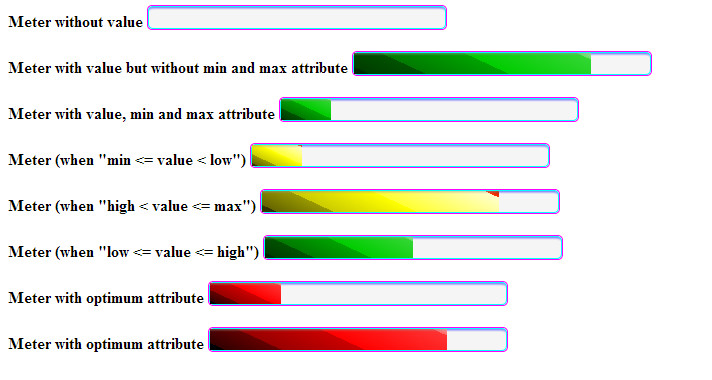
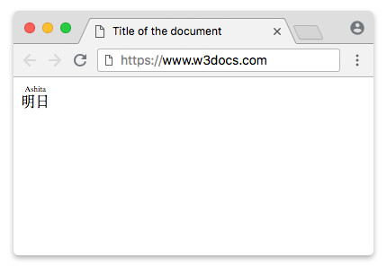

# Novedades en HTML5

El W3C ha preparado un documento, HTML5 differences from HTML4, en el que detalla las principales diferencias entre HTML4 (y su variante según XML, XHTML 1.0) y la nueva versión del lenguaje, HTML5.

Algunas de las principales diferencias son:

- HTML5 define una sintaxis que es compatible con HTML4 y XHTML 1.0. Por tanto, un salto de línea se puede escribir como <br> (HTML4) o <br /> (XHTML 1.0).
- Para definir el juego de caracteres se introduce un nuevo atributo para la etiqueta <meta>:
    <meta charset=”UTF-8″>
    aunque todavía es posible utilizar el método tradicional:
    <meta http-equiv=”Content-Type” content=”text/html; charset=UTF-8″>
- Se simplica el DOCTYPE:
    <!DOCTYPE html>
- HTML5 permite incluir elementos de SVG y MathML.
- Se introducen nuevos elementos, como: section, article, aside, header, footer, etc.
- Se introducen nuevos atributos, como: media, charset, autofocus, placeholder, etc.
- Algunos elementos cambian, como: a, b, i, menu, etc.
- Algunos atributos cambian, como: type, name, summary, etc.
- Algunos elementos desaparecen, como: basefont, big, center, etc.
- Algunos atributos desaparecen, como: align, background, bgcolor, etc.
- Mejora de las API, como: getElementsByClassName() y innerHTML.

<area />, , <br />,

<col />
, ,
<hr />
, , <input />, <link />, <meta />, <param />,

,

y <wbr />

## Nuevos Elementos HTML5

Etiqueta Descripción

## header: Define el header para un documento o una sección.

## hgroup (eliminado)

Agrupa los elementos para el encabezado. Permitía agrupar elmentos de h1 a h6, para dar consistencia, por ejemplo un título y un subtítulo, etc.

```html
<hgroup>
  <h1>Alien</h1>
  <h2>En el espacio, nadie te escuchará gritar</h2>
</hgroup>
<p>
  La nave comercial Nostromo recibe una llamada de auxilio desde un planeta no
  explorado. Luego de buscar sobrevivientes, la tripulación se dirige a casa
  sólo para darse cuenta que una mortal forma de vida se les ha unido.
</p>
```

## nav: Define los enlaces de navegación en un documento.

Vamos a ver la nueva etiqueta nav HTML5 que nos vale para definir el conjunto de código de un menú de navegación. Esto proporciona información semántica al navegador, sabiendo que en esa sección se encuentran los enlaces que forman un menú de navegación. Se debe utilizar para el menú principal o bloques principales de navegación.

No confundir con las etiquetas section o menu, nav sólamente contiene enlaces a las diferentes secciones de la web

```html
<nav>
  <a href="/enlace1/">Enlace 1</a>
  <a href="/enlace2/">Enlace 2</a>
  <a href="/enlace3/">Enlace 3</a>
  <a href="/enlace4/">enlace 4</a>
</nav>
```

Esta etiqueta puede ir dentro de un header, o de cualquier otra sección.

## section

Define una sección en el documento. Es un elemento de seccionamiento genérico, diseñado para contener una parte de un documento temáticamente definida. Los contenidos de un elemento section son usualmente precedidos por un encabezado. En caso de querer agrupar elementos de temática diferente, pero que queremos dar un estilo uniforme, deberems utilziar el elemento div en lugar de éste.

```html
<section>
  <h1>Anuncios</h1>
  <p>
    <a href="http://www.super-frogger-shaper-5000.com"
      >Super frogger shaper 5000. Todo lo que necesitas para estar en forma!</a
    >
  </p>
</section>
<main>
  <h1>¿Cómo mantenerte en forma?</h1>
  <p>Llevar un estilo de vida saludable es muy importante...</p>
</main>
<section>
  <h1>Artículos relacionados</h1>
  <ul>
    <li>
      <a href="comida-saludable.html">Incluye comida saludable en tu dieta</a>
    </li>
    <li>
      <a href="habitos-de-descanso.html">Adopta buenos hábitos de descanso</a>
    </li>
  </ul>
</section>
```

En este ejemplo, vemos como para la parte principal usamos el elemento main, mientras usamos section para las otras partes.

## main

Define el contenido principal del documento. El elemento main es un contenedor para los temas centrales de un documento o sección. Este contenido central puede interpretarse como todo lo que resta luego de quitar anuncios, encabezados (header), pies (footer), secciones de navegación (nav), vínculos relacionados y otros elementos secundarios.

El elemento main tiene mayor importancia para personas con discapacidades, que habitualmente acceden a la web a través de programas especiales como los navegadores de voz. En tales casos, los navegadores pueden ser instruidos para ir directamente al contenido principal del documento o sección (main), saltándose toda la información menos relevante.

No existen restricciones en cuanto al número de elementos main que puede contener un documento, pero solo puede estar visible uno a la vez (atributo hidden)

Como ancestros, solo puede tener los elementos html, body, div y form.

## article

Define un artículo del documento.

El elemento article es un contenedor de bloques de contenido que se consideran independientes del sitio web y pueden, por lo tanto, ser vistos, reutilizados y distribuidos por separado, como por ejemplo, en la sindicación. Puedes encontrar habitualmente a este elemento encerrando artículos, entradas de blogs o mensajes de un foro.

Cuando dos o más de estos elementos están anidados, se supone que el elemento article interior guarda relación con el elemento article que actúa como padre. Este podría ser el caso de una entrada de blog (siendo en sí misma un article), donde cada comentario puede estar encerrado por un elemento article.

El elemento article puede ser utilizado en conjunto con otros elementos como header, footer y time para agregar información acerca de su contenido. Esta información puede ser utilizada, por ejemplo, por navegadores o lectores de noticias.

No debes confundir los elementos article y section. El elemento article tiene un mayor significado e implica que sus contenidos pueden ser tratados independientemente del documento que los contiene.

```html
<article>
  <header>
    <h1>La cocina china</h1>
    <p>
      Publicado
      <time pubdate datetime="2014-03-28T20:00-04:00">2 meses atrás</time>
    </p>
  </header>
  <p>
    La cocina china incluye estilos originarios de diversas regiones de China,
    así como de personas chinas en otras partes del mundo. La historia de la
    cocina en China se remonta a cientos de años atrás y ha cambiado de período
    a período y en cada región de acuerdo al clima, las modas imperiales, y la
    preferencia local.
  </p>
  <p>...</p>
  <footer>
    <p>&copy; Todos los derechos reservados</p>
  </footer>
</article>
```

## aside

Define contenido secundario de la página.

El elemento aside es un contenedor para información que se considera solo levemente relacionada al documento o la sección en la que es definida. En otras palabras, el contenido del elemento aside debe estar relacionado al contenido circundante, pero no ser completamente necesario para su comprensión.

El elemento aside puede ser típicamente encontrado alrededor de enlaces de blogrolls, enlaces al archivo, un glosario, una lista de tweets del autor, o notas, pensamientos o ideas que se le han ocurrido al autor durante la producción del documento. Asimismo, puedes ver ejemplos perfectos de notas al margen en revistas y diarios impresos, donde se provee información adicional (pero no crítica) para enriquecer la experiencia del usuario.

Los autores no deberían utilizar el elemento aside para encerrar contenido que no guarda relación con la sección en la que se define. Su contenido debe tener alguna relación con su entorno.

```html
<h1>El blog de astrofotografía de Pepe</h1>
<p>Este es mi blog, y aquí te puedes encontrar...</p>
<aside>
  <nav>
    <h1>Sitios relacionados</h1>
    <ul>
      <li>
        <a href="http://science.nasa.gov/astrophysics/"
          >Astrofísica - NASA Science</a
        >
      </li>
      <li>
        <a href="http://www-astro.physics.ox.ac.uk/"
          >Astrofísica | Universidad de Oxford</a
        >
      </li>
      <li>
        <a href="https://danielmarin.naukas.com/">Blog de Daniel Marín</a>
      </li>
      <li>...</li>
    </ul>
  </nav>
</aside>
```

## footer

El elemento footer representa al pie de una sección o documento, donde los autores habitualmente colocan firmas, información acerca del autor, información de licencias, documentos relacionados, etc. En muchos casos, los contenidos del pie de un documento son consistentes a lo largo de todo el sitio.

Cuando un elemento footer es declarado dentro de un elemento de seccionamiento (como article o section) representa un pie en el ámbito de ese elmento. De lo contrario (cuando pertenece al elemento body) representa un pie para el documento entero.

Aunque es una práctica común colocar los pies al final de la página o sección, no es necesario que ocupen ese lugar. Un pie es un pie por lo que representa, no por su ubicación.

La información de contacto acerca del autor de un documento o artículo corresponde dentro del elemento address el cual podría incluirse, a su vez, dentro de un elemento footer.

```html
<article>
  <h1>El extranjero</h1>
  <p>
    "Suficiente!" dijo el pequeño hombre, mientras se levantaba de su
    desbaratada silla...
  </p>
  <footer>
    <p>Copyright &copy; 1990-2014 Peter Doe, todos los derechos reservados.</p>
  </footer>
</article>
```

## details

Define detalles adicionales que el usuario puede ver o esconder.

El elemento details representa un trozo de contenido oculto que puede ser mostrado a pedido del usuario. Este elemento está pensado para implementar soporte nativo para contenido colapsable y es habitualmente representado por un título (provisto por el elemento summary) acompañado por una flecha que sugirere al usuario que hay más contenido que puede ser accedido. Cuando el usuario hace clic en el título o la flecha, el contenido es automáticamente mostrado.

Múltiples elementos details pueden ser perfectamente anidados para formar un conjunto de contenidos colapsables en una distribución jerárquica. Adicionalmente, el atributo open puede ser usado para hacer que el contenido del elemento sea inicialmente visible.

Un título o etiqueta puede ser provisto para el contenido colapsable. En tal caso, éste debe ser representado por un elemento summary, que debe ser el primer hijo del elemento details al cual pertenece.

El soporte provisto por los navegadores para el elemento details es incompleto. Los autores pueden tener que recurrir a programas para lograr su mismo efecto consistentemente.

```html
<p>
  La mayoría de procesos astrofísicos no pueden ser recreados en los
  laboratorios de la Tierra. En cualquier caso, existe una gran variedad de
  objetos astronómicos visibles a lo largo de todo el espectro electromagnético.
  El estudio de dichos objetos mediante la adquisición pasiva de datos es el
  objetivo de la astronomía observacional.
</p>
<details open>
  <summary>Galileo Galilei</summary>
  
  <p>
    Galileo Galilei fue un astrónomo, filósofo, ingeniero, matemático y físico
    italiano, relacionado estrechamente con la revolución científica. Eminente
    hombre del Renacimiento, mostró interés por casi todas las ciencias y artes
    (música, literatura, pintura).
  </p>
  <p>
    Sus logros incluyen la mejora del telescopio, gran variedad de observaciones
    astronómicas, la primera ley del movimiento y un apoyo determinante al
    copernicanismo.
  </p>
</details>
```

Fíjese en el ejemplo anterior en el atributo open, para indicar que por defecto este panel está visible

## summary

Define un encabezado visible para un elemento &lt;details&gt;.

El elemento summary representa un resumen, título o etiqueta para los contenidos de un elemento details. La descripción provista por este elemento será mostrada encima de los contenidos del elemento details para el cual ha sido declarado.

El soporte provisto por los navegadores para details y summary es incompleto. Los autores pueden tener que recurrir a programas para lograr los mismos efectos consistentemente.

```html
<p>
  <b>Cosmos: un viaje personal</b> es una serie documental de divulgación
  científica escrita por Carl Sagan, Ann Druyan y Steven Soter (con Sagan como
  guionista principal y presentador), cuyos objetivos fundamentales fueron:
  difundir la historia de la astronomía y de la ciencia, así como sobre el
  origen de la vida; concienciar sobre el lugar que ocupa nuestra especie y
  nuestro planeta en el universo, y presentar las modernas visiones de la
  cosmología y las últimas noticias de la exploración espacial, y en particular,
  las misiones Voyager.
</p>
<details>
  <summary>Carl Sagan</summary>
  <p>
    Carl Edward Sagan fue un astrónomo, astrofísico, cosmólogo, escritor y
    divulgador científico estadounidense. Sagan publicó numerosos artículos
    científicos y comunicaciones1 y fue autor, coautor o editor de más de una
    veintena de libros. Defensor del pensamiento escéptico científico y del
    método científico, fue también pionero de la exobiología, promotor de la
    búsqueda de inteligencia extraterrestre a través del Proyecto SETI e impulsó
    el envío de mensajes a bordo de sondas espaciales, destinados a informar a
    posibles civilizaciones extraterrestres acerca de la cultura humana.
  </p>
</details>
```

Se verá el texto Carl Sagan, y el demás permanece oculto con un símbolo para mostrarlo

## figure

Define un contenido independiente, como una ilustración, diagrama, foto, etc.

El elemento figure representa a una pieza de documento autocontenido que se utiliza habitualmente para encerrar imágenes, gráficos, tablas de referencia, videos, poemas, fragmentos de código, etc. Ésta, podrían ser acompañada por una leyenda o título (elemento figcaption) que puede usarse para hacer una referencia al fragmento desde alguna otra parte del documento. Además del título opcional, un elemento figure puede contener a otros elementos como imágenes (img), párrafos (p), código de computadora (code), citas (cite), etc.

Ser autocontenido significa que figure tiene cierto grado de independencia del flujo del documento, y su posición relativa al contenido circundante no necesita ser exacta.

Las imágenes ubicadas junto bloques de texto en un períodico contituyen buenos ejemplos de uso apropiado de los elementos figure y figcaption.

Cuando figure tiene información que sóle está tangencialmente relacionada al contenido circundante, el elemento aside debería ser utilizado en su lugar, opcionalmente contienendo éste mismo un elemento figure.

```html
<h1>Análisis de uso de los navegadores</h1>
<figure style="float: right">
  
  <figcaption>Gráfico A: Uso de navegadores</figcaption>
</figure>
<p>
  En la batalla por el dominio del acceso web, el navegador Chrome toma la
  delantera con más del 40% de los usuarios. Como puedes ver en el gráfico A,
  esto es casi el doble del uso de su primer competidor, Internet Explorer, el
  cual toma el segundo lugar con el 24%.
</p>
```

## figcaption

Define una título para un elemento &lt;figure&gt;.
El elemento figcaption representa un título o leyenda de un fragmento de contenido (figure). Un elemento figure representa a un trozo de documento autocontenido que se usa habitualmente para encerrar imágenes, gráficos, tablas de referencia, videos, poemas, fragmentos de código, etc.

La presencia del elemento figcaption dentro de figure es opcional, pero si está presente, sólo puede hacer uno y debe estar ubicado al comienzo o al final del elemento figure al cual pertenece.

## mark

Define texto resaltado o marcado.

El elemento mark representa a un trozo de texto remarcado o resaltado al cual los autores pueden referirse desde otro documento, con el fin de analizarlo o explicarlo. Este elemento puede ser habitualmente encontrado encerrando áreas de texto sobre las que el autor desea hablar o que son relevantes a la actividad actual del usuario.

El elemento mark es particularmente útil para resaltar líneas de texto en una cita (blockquote) con el propósito de hacer una referencia a éstas desde el documento actual.

```html
<p>Luego sigue:</p>
<blockquote>
  El ingeniero y Pencroft,
  <mark>cada uno armado con un arma de doble barril</mark>, y Gideon Spilett
  cargando su rifle, no tenían más que comenzar.
</blockquote>
<p>Queda muy claro que no esperaban otra cosa más que problemas...</p>
```

## time

Define una fecha/hora.

El elemento time representa fechas, horas, desplazamientos de zonas horarias y duraciones. Adicionalmente, una versión específica para programas de los contenidos del elemento puede ser provista en el atributo datetime.

Aunque la presencia del atributo datetime no es obligatoria, ésta puede ser útil para brindar una versión de los contenidos del elemento más sencilla de manejar para los programas, que no requiere la alteración de éstos.

Si el elemento time es declarado sin el atributo datetime, éste no puede tener ningún elemento como descendiente.

Las posibles variantes de la versión para programas que el atributo datetime puede proveer deben coincidir con cualquiera de las sintaxis descriptas debajo.

```html
<time>2014-10-29 23:59:59.999</time>
<time>1999-12-03 10:20:00.000</time>
<time>2000-12-15T10:20</time>
<time>1823-01-02T10:53:12.2</time>
```

```html
<p>
  Nos casamos <time datetime="1982-10-06">el 6 de Octubre, allá por 1982</time>.
  <time datetime="1982-11-06">Un mes más tarde</time> supimos que Brian estaba
  en camino.
</p>
```

## bdi

Define una parte del texto que puede ser formateada de una manera diferente a la del texto principal.

El elemento bdi aísla a un trozo de texto del contenido circundante con propósitos de formateo bidireccional de texto. Este elemento resulta muy útil en situaciones en las que el algoritmo bidireccional, responsable de decirdir automáticamente la dirección del texto, puede "confundirse" y cambiar incorrectamente la dirección del texto.

A diferencia de los demás elementos del estándar, el valor del atributo dir no es heredado en bdi. Su valor por defecto es siempre auto.

El elemento bdi ha sido introducido en HTML5 y no es completamente soportado por los navegadores. Aunque su uso es inofensivo, los autores deberian considerar su complementación con CSS con motivos de compatibilidad.

```html
<ul>
  <li>
    <b><bdi>Aaron</bdi> (2):</b> Hola!
  </li>
  <li>
    <b><bdi>נקניק</bdi> (5):</b> Hola! Cómo estás?
  </li>
  <li>
    <b><bdi>Aaron</bdi> (2):</b> Bueno, ha sido una semana larga, pero creo que
    no puedo quejarme.
  </li>
  <li>
    <b><bdi>נקניק</bdi> (5):</b> Wow, estamos en la misma luna...
  </li>
</ul>
```

## wbr

Define un posible retorno de carro.

El elemento wbr representa una oportunidad de quiebre de línea. Este elemento puede ser muy útil en situaciones donde la comprensión de la información puede verse afectada por un quiebre de línea mal ubicado. Gracias a este elemento, los autores pueden especificar dónde deberían producirse los quiebres de línea, en caso de ser necesarios.

```html
<p>
  Entonces tienes que invocar a la función
  <code
    >toma<wbr />Estos<wbr />Dos<wbr />Valores<wbr />Y<wbr />Haz<wbr />Una<wbr />Operacion<wbr />Realmente<wbr />Compleja<wbr />Con<wbr />Ellos(int
    a, int b)</code
  >
  y pásale los dos resultados obtenidos anteriormente.
</p>
```

## dialog

Define una caja de diálogo o ventana

El elemento dialog representa una parte del documento pensada para la interacción con el usuario, como por ejemplo, un cuadro de diálogo, un inspector o una ventana. HTML5 ha agregado este elemento para ofrecer a los autores soporte nativo para una característica que se ha estado logrando mediante programas por un largo tiempo. Las cajas de diálogo no sólo son parte de los documentos web, sino que han sido utilizadas en programas de escritorio por muchos años.

La definición de un elemento dialog es sencilla: solo es necesario delcarar cualquier número de elementos entre sus etiquetas de apertura y cierre. La implementación que lo hará funcionar como se espera, por otra parte, requiere el uso de programas del lado cliente. Esto se debe obviamente a la naturaleza interactiva del elemento dialog.

El atributo open puede ser declarado en un elemento dialog para indicar que el elemento debería ser inicialmente visible.

Hasta el 31/03/2015, el soporte provisto por los navegadores para el elemento dialog es muy bajo. Los autores pueden tener que recurrir a programas para lograr el mismo efecto consistentemente, hasta que el soporte crezca.

```html
<button type="button" onclick="abrirDialogo('dialogo1')">Abrir diálogo</button>
<dialog id="dialogo1">
  <p>Hola! Este es nuestro primer diálogo. Si te gusta, no lo cierres...</p>
  <button type="button" onclick="cerrarDialogo('dialogo1')">Cerrar</button>
</dialog>
```

## command

Define un botón de comando al que el usuario puede llamar

## meter

El elemento meter representa una medida dentro de un rango conocido. Este elemento, nuevo en HTML5, puede ser útil para representar medidas en diferentes situaciones, como uso de disco, memoria o ancho de banda, los resultados de un encuesta, la cantidad recaudada en una colecta, el número de registros coincidentes en una consulta, etc.

El elemento meter soporta seis atributos especiales diseñados para agregar información acerca de los valores que éste contiene. Los atributos min y max representan los límites inferior y superior del rango. Los atributos low y high ayudarán a los autores a definir segmentos (desde los márgenes) que contendrán valores considerados como bajos y altos respectivamente, mientras que optimal indicará cuál es el valor óptimo en esta medida. Por último, el atributo value representa el valor tomado por esta medida.

Los autores no deben confudir a este elemento con progress. A diferencia de meter, el elemento progress mide únicamente la completitud de una tarea.

Si los atributos min y max no son declarados en este control, los límites de esta medida serán los predeterminados 0 (límite inferior) y 1 (límite superior).

Aunque no existe una forma explícita de especificar las unidades en el elemento meter, éstas pueden proveerse en el atributo title en texto de forma libre.

El soporte provisto por los navegadores para meter es incompleto. Los atutores pueden tener que recurrir a programas y/u hojas de estilo para lograr los mismo efectos consistentemente.

```html
<p>
  Uso de la memoria RAM:
  <meter max="2048" value="547" title="Megabytes">547/2048</meter>
</p>
```



## progress

El elemento progress representa el estado de progreso de una operación, como ser la transferencia de un archivo, una codificación o la recuperación de valores desde una base de datos. Este control es normalmente representado por una barra de progreso, compuesta por un contenedor que es llenado de izquierda a derecha de acuerdo con el progreso de la operación.

Una barra progress puede representar un progreso en dos estados: como indeterminado, indicando que el proceso está siendo llevado a cabo pero no existe información acerca de su estado de completitud; o como un valor que indica la cantidad de trabajo que ha sido realizado en la tarea.

Los autores no deben confundir este elemento con meter. A diferencia de meter, el elemento progress mide únicamente la completitud de una tarea.

El progreso en un control progress es medido entre 0 y el valor del atributo max. Si este atributo no está definido, toma el valor por defecto de 1.

El soporte provisto por los navegadores para el elemento progress es incompleto. Los autores pueden tener que recurrir a programas para lograr los mismos efectos consistentemente.

```html
<p>Progreso de la subida: <progress max="68" value="47">47/68</progress></p>
```

## ruby: Define una anotación ruby (para tipografía del este asiático) .

El elemento ruby provee los medios para aplicar anotaciones ruby a una línea de texto. Las anotaciones ruby son trozos cortos de texto que corren a la par del texto base y proveen algún tipo de ayuda para procesarlo. Son mayormente utilizadas en la tipografía asiática, pero pueden ser útiles para cualquier tipo de anotaciones.

El texto con anotaciones ruby se encuentra dentro del elemento ruby, mientras que rt provee las anotaciones para todos los caracteres no anotados que se encuentran a su izquierda. Por su parte, el elemento rp provee los medios para ocultar información adicional utilizada para mejorar la lectura en navegadores que no soportan las anotaciones. El texto dentro del elemento ruby se muestra como una sola línea de texto en navegadores que no lo soportan, por lo que puede ser razonable proveer, por ejemplo, paréntesis (ocultos dentro del elemento rp) para encerrar las anotaciones.

Un elemento rt provee anotaciones para todos los caracteres ubicados a su izquierda que todavía no han sido anotados.

El soporte provisto por los navegadores para los elementos ruby (ruby, rt y rp) es incompleto. Los autores pueden tener que recurrir a técnicas de estilo (CSS) para lograr que las anotaciones ruby funcionen consistentemente.

```html
<p>
  Los cuatro símbolos en el mazo de cartas de póker con
  <ruby>♥<rp>(</rp><rt>corazón</rt><rp>)</rp></ruby>,
  <ruby>♠<rp>(</rp><rt>pica</rt><rp>)</rp></ruby>,
  <ruby>♣<rp>(</rp><rt>trébol</rt><rp>)</rp></ruby> and
  <ruby>♦<rp>(</rp><rt>diamante</rt><rp>)</rp></ruby>.
</p>
```



## rt

Define una pronunciación de caracteres (para tipografía del este asiático)
El elemento rt provee una anotación ruby para todo el texto no anotado que lo precede dentro del elemento ruby en el cual se encuentra. El elemento rt es habitualmente acompañado por el elemento rp, el cual provee los medios para ocultar información utilizada para mejorar la legibilidad en navegadores que no soportan estos elementos. Los contenidos del elemento rp son invisibles en navegadores que soportan anotaciones ruby.

Un elemento rt provee anotaciones para todos los caracteres ubicados a su izquierda que todavía no han sido anotados.

El soporte provisto por los navegadores para los elementos ruby (ruby, rt y rp) es incompleto. Los autores pueden tener que recurrir a técnicas de estilo (CSS) para lograr que las anotaciones ruby funcionen consistentemente.

## rp

Define lo que se puede mostrar en los navegadores que no soporta las anotaciones ruby.

El elemento rp provee los medios para ocurtar información en anotaciones ruby (ruby). El principal propósito de este elemento es el de hacer que ruby se más compatible, especialmente debido al soporte parcial provisto por los navegadores.

En navegadores que soportan las anotaciones ruby, cualquier cosa que se encuentre dentro del elemento rp no solo será invisible para el usuario, sino que también carecerá de significado para el documento.

El soporte provisto por los navegadores para los elementos ruby (ruby, rt y rp) es incompleto. Los autores pueden tener que recurrir a técnicas de estilo (CSS) para lograr que las anotaciones ruby funcionen consistentemente.

## embed

El elemento embed provee los medios para insertar acplicaciones externas, típicamente aquellas que requieren un plugin, en el documento.

Este elemento, introducido por Netscape 2 y luego adoptado por Internet Explorer 3 (a principio de los 90), no ha sido nunca parte de un estándar HTML. Sin embargo, ha sido muy bien soportado por todos los navegadores del mercado y frecuentemente utilizado en múltiples sitios web, principalmente, para insertar películas de Flash. Al estar tan bien soportado, básicamente gracias a su longevidad, el elemento embed era la primera opción cuando los autores necesitaban incrustar películas Flash en sus documentos, a pesar del hecho de que nunca ha sido reglamentario. Esto, sumado a las defectuosas e irregulares implementaciones del elemento object, ha llevado a HTML5 a incluirlo en la especificación.

Este elemento acepta cualquier atributo definido por el usuario que no concuerde con otros nombres de atributos en la especificación. Los valores de estos atributos serán pasados a la aplicación que el elemento incruste como parámetros.

El uso de cualquiera de los atributos tradicionales (name, align, hspace y vspace) está prohibido, por producir efectos secundarios inapropiados.

Ejemplo

```html
<p>Aquí tienes la versión MIDI de "Aire para la cuerda de sol".</p>
<embed
  src="/assets/audio/Bach_Air_on_the_G_string.mid"
  type="audio/mid"
  autostart="false"
/>
```

Esta etiqueta admite los siguientes parámetros:

- src: El URI del recurso que será incrustado. Es obligatorio si el atributo itemprop está presente
- type: Para indicar el tipo de archivo. Se pueden consultar [aquí](https://www.htmlquick.com/es/reference/mime-types.html){:target="\_blank"}
- width
- height

## area (HTML3)

El elemento area define una sección en un mapa de imagen. Los mapas de imagen permiten a los autores definir secciones en una imagen y, opcionalmente, convertirlas en hipervínculos que apuntan a otros recursos. En otras palabras, los mapas de imagen hacen posbile la creación de un vínculo a partir de una o más secciones de la imagen (img) a la que se encuentran asociados.

Existen cuatro tipos de figuras que pueden ser definidas para cada área del mapa de imagen, declarando cualquiera de los valores listados a continuación en el atributo shape. El atributo coords debe proveer las coordenadas de la forma de manera específica para cada tipo de area.

- default: todo el área del mapa. El atributo coords no es necesario.
- rect: una región rectangular. El atributo coords debe proveer dos esquinas opuestas "izquierda-x, arriba-y, derecha-x, abajo-y".
- circle: una región circular. El atributo coords debe proveer el centro y el radio "centro-x, centro-y, radio". Si el radio se mide en porcentajes, es calculado como relativo al tamaño menor del objeto asociado.
- poly: el área encerrada dentro de un polígono. El atributo coords debe proveer, una a una, las coordenadas de los vértices "x1, y1, x2, y2, ..., xn, yn". Si éstas definen un polígono abierto, el navegador debería cerrarlo agregando un segmento entre el primer vértice y el último.

En versiones previas del estándar, los autores también podían definir las áreas de un mapa de imagen con el elemento a. En HTML5 sólo el elemento area provee esta funcionalidad.

El elemento area solo puede tener un elemento map como padre. No puede ser declarado como hijo de ningún otro elemento.

En HTML5, el atributo alt es obligatorio cuando el atributo href está presente y debe ser omitido en caso contrario. También es requerido que se especifiquen las coordenadas para la forma (en el atributo coords) si no se ha optado por la forma "default".

```html
<map name="image-map-1">
  <area
    href="../../tutorials.html"
    alt="Tutoriales HTML"
    shape="circle"
    coords="67,73,47"
  />
  <area
    href="../../tutorials.html"
    alt="Tutoriales HTML"
    shape="rect"
    coords="60,54,142,99"
  />
</map>

```

Lista de parámetros:

- alt: Versión de texto. Es obligatorio si tenemos presente el parámetro href
- shape
- coords
- href
- target: Puede tomar los siguientes valores:
  \_blank: el vínculo se abrirá en una nueva ventana.
  \_parent: el vínculo se abrirá en el contexto padre inmediato.
  \_self: el vínculo se abrirá en el mismo contexto que contiene al vínculo.
  \_top: el vínculo se abrirá en el más alto contexto de navegación (el contexto más exterior que contiene al vínculo).
- download: Un valor booleano que indica si el recurso enlazado debería ser descargado a la máquina del usuario o abrirse en el navegador.
- ping: Este parámetro es una lista de url's a las que el navegador debería hacer ping cuando el enlace sea activado. Esto se hace sobre todo a efectos estadísticos.
- rel
- referrerpolicy
- hreflang
- type
- nohref

## base

El elemento base puede proveer un URI para resolver todos los URIs relativos en el documento, o para definir el contexto predeterminado en el que se abrirán todos los vínculos del documento. Resumidamente, establece la conducta predeterminada para vínculos y resolución de URIs en un documento HTML.

El elemento base puede ser declarado únicamente en la sección head del documento y sólo una vez y, debido a su propósito, debe preceder a todos los elementos que precisan de la resolución de URIs o que representan hypervínculos.

```html
<head>
  <title>Imágenes de postres</title>
  <base href="http://www.misitio.es/imagenes/postres/" />
</head>
<body>
  
  
  
</body>
```

### source

El elemento source permite a los autores proveer diferentes versiones de un archivo en los elementos de medios (audio y video) y las imágenes (picture). Un elemento de medios o imagen puede contener uno o más elementos source, cada uno de lo cuales provee una versión diferente del medio (codificado utilizando un códec diferente) o imagen (en diferentes tamaños o formatos). Entonces, queda en manos del navegador elegir qué recurso cargar, una decisión que tomará en base a los formatos que soporta y a las dimensiones de la imagen (mejor coincidencia).

Los autores deben elegir una de las dos formas de especificar un recurso de medios pero nunca ambas. Si se declara el atributo src en el elemento de medios (audio y video), no será posible proveer alternativas con el elemento source.

El soporte provisto por los navegadores para el elemento picture es muy bajo. Los autores pueden tener que recurrir a media queries para lograr el mismo efecto consistentemente, hasta que el soporte crezca.

Ejemplo:

```html
<audio controls>
  <source
    src="/assets/audio/Jahzzar_The_Flowers_Are_Still_Standing.ogg"
    type="audio/ogg"
  />
  <source
    src="/assets/audio/Jahzzar_The_Flowers_Are_Still_Standing.mp3"
    type="audio/mpeg"
  />
</audio>
```

Ejemplo con vídeo:

```html
<video width="384" height="288" controls>
  <source src="/assets/videos/A_Flight_To_Mars.mp4" type="video/mp4" />
  <source src="/assets/videos/A_Flight_To_Mars.webm" type="video/webm" />
  <source src="/assets/videos/A_Flight_To_Mars.ogg" type="video/ogg" />
</video>
```

Para los navegadores que soportan al elemento video, no hace falta proveer más que dos formatos (MP4 y Ogg) para hacer que el video sea reproducido correctamente en todos los navegadores. Sin embargo, pondremos a disponibilidad una tercera versión, WebM, por ser la mejor candidata a convertirse en el estándar para web en el futuro cercano.

Para mejorar la compatibilidad aún más, pondremos a la versión en MP4 primero, para evitar un error particular en los navegadores de iPad.

Ejemplo con imágen:

```html
<picture>
  <source
    media="(min-width: 1280px)"
    srcset="/assets/images/charles-darwin-l.jpg"
  />
  <source media="(max-width: 520px)" srcset="../../../charles-darwin-s.jpg" />
  
</picture>
<p>
  Charles Robert Darwin fue un naturalista inglés que postuló todas las especies
  de seres vivos que han evolucionado con el tiempo a partir de un antepasado
  común mediante un proceso denominado selección natural. La evolución fue
  aceptada como un hecho por la comunidad científica y por buena parte del
  público en vida de Darwin, mientras que su teoría de la evolución mediante
  selección natural no fue considerada como la explicación primaria del proceso
  evolutivo hasta los años 1930.
</p>
```

## track

## Elementos eliminados:

- acronym
- applet
- basefont
- big
- center
- dir
- font
- frame
- frameset
- noframes
- strike
- tt
