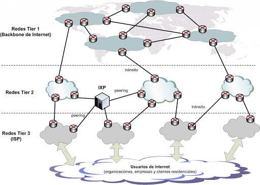

# Internet arquitectura de red. Origen, evolución y estado actual

## Arquitectura de red.

La estructura actual de Internet

La estructura actual de Internet está basada en la interconexión de redes de forma más o menos jerárquica con varios niveles, conocidos como tiers. De forma general existen tres niveles conocidos como Tier 1, Tier 2 y Tier 3. Las principales características de cada nivel son:

- Las redes Tier 1 son las redes de los grandes operadores globales (Global Carriers) que tienen tendidos de fibra óptica por al menos dos continentes. Desde una red Tier 1 se puede acceder a cualquier punto de Internet gracias a que es una condición necesaria que todas las redes Tier 1 tienen que estar conectadas entre sí. Se puede decir que las redes Tier 1 forman el actual **backbone** ó troncal de Internet. Algunos ejemplos de compañías que poseen redes Tier 1 son:

  - AOL a través de ATDN (AOL Transit Data Network)
  - AT&T
  - Verizon
  - Inteliquent
  - NTT Communications
  - Telefonica International Wholesale Services (TIWS)

- Las redes Tier 2 son operadores de ámbito más regional que no pueden alcanzar todos los puntos de Internet y que necesitan conectarse a una red Tier 1 para ello. Su principal función es ofrecer servicios de conectividad a los operadores Tier 3. Ejemplos de operadores Tier 2:

  - Cable&Wireless
  - British Telecom
  - SingTel (Singapore Telecommunications Limited)

- Las redes Tier 3 pertenecen a los operadores que dan servicio de conexión a Internet a los usuarios residenciales y a muchas empresas, los que conocemos como ISP (Internet Service Provider) o Proveedores de acceso a Internet. Algunos ejemplos son:

  - En España: Movistar, Vodafone, Orange, Ono …
  - En Latinoamérica: Movistar, TELMEX, AXTEL, Claro…

Las conexiones entre redes de diferentes operadores se realiza de la siguiente manera.

- **Conexiones de tránsito**. Conexión entre operadores de diferente jerarquía. El operador de mayor jerarquía (proveedor) vende una conexión de tránsito al operador de menor jerarquía (cliente). El proveedor le da acceso al cliente a todas sus rutas, es decir, el cliente recibirá tanto las rutas de la red del proveedor como a rutas con destino a otras redes. El cliente publica al proveedor sólo sus rutas y no otras que pueda tener con otros proveedores.

Por definición, las redes Tier 1 son las únicas que no utilizan conexiones de tránsito.

- **Conexión de peering**. Conexión utilizada para el intercambio de tráfico sin coste entre dos operadores. Cada operador publica sólo sus rutas y no otras rutas que tenga con otros proveedores u otras rutas de peering, es decir, el peering sirve para acceder desde un operador al rango de direcciones IP del otro operador, pero no sirve para llegar a otros rangos de direcciones. Puede ser de dos tipos:

  - Públicos: utilizando un IXP (ver el siguiente apartado)
  - Privados: conexión directa entre los dos proveedores.

IXP (Internet eXchange Point o Punto de intercambio de tráfico de Internet) es una infraestructura física que permite a diferentes ISP intercambiar tráfico de Internet entre sus redes. En realidad, cualquier empresa que quiera establecer una conexión pública de peering con un ISP puede utilizar un IXP. Habitualmente, los acuerdos de peering entre empresas facilitan el intercambio más eficiente de datos entre sus redes, es por ello, que los IXP han tenido un impacto muy beneficioso en el crecimiento de Internet.

En Europa existe una asociación de IXP llamada [Euro-IX](www.euro-ix.net) que agrupa a todos los IXP europeos y algunos IXP de Japón y Estados Unidos.

## Origen, evolución y estado actual

Desde su nacimiento, se podría decir que Internet ha pasado ya por varias fases. De hecho, su incorporación en los nuevos dispositivos (smartphones, tabletas…) posiblemente esté abriendo las puertas de un nuevo salto evolutivo en su corta pero intensa historia.

En este artículo se ofrece un repaso a los hitos más relevantes que marcaron el nacimiento y los primeros pasos de Internet hasta llegar a lo que conocemos actualmente.

### ¿Cuándo y dónde nació Internet?

Realmente no hay un consenso claro en definir la “fecha de nacimiento” oficial. Algunos autores sitúan este momento en el nacimiento de ARPANET en 1969. Este hecho se puede considerar el embrión de Internet por ser el primer intento de unir computadoras situadas en distintos lugares, pero no se puede considerar Internet todavía. La definición más extendida de Internet es la de Red de redes. ARPANET no es una red de redes sino unas cuantas computadoras unidas entre sí mediante conexiones telefónicas.

Sería más correcto señalar como el nacimiento de Internet a la puesta en servicio de la red NSFNET, una red que ya utiliza los protocolos TCP/IP y cuya misión es la de ser troncal para la conexión de redes. Este hecho se produce en 1985 ([http://www.nsfnet-legacy.org/about.php](http://www.nsfnet-legacy.org/about.php)) aún cuando ARPANET sigue en servicio. Es por ello, que NSFNET se considera una evolución o continuación de ARPANET aunque realmente su objetivo es ya claramente la interconexión de redes, eso sí, utilizando todos los desarrollos y éxitos de ARPANET.

En cualquier caso su nacimiento no es un hecho puntual sino más bien una evolución.

Lo que sí está claro es dónde nace Internet. Su lugar de nacimiento es Estados Unidos.

### Etapa embrionaria 1969-1984

Todo empieza cuando el Departamento de Defensa de Estados Unidos pide a su agencia de investigación llamada ARPA el diseño de una red confiable que uniera sus centros de datos. Aunque la razón de este encargo fue que el Departamento de Defensa de Estados Unidos consideraba que el tipo de líneas utilizadas en esa época (básicamente líneas telefónicas alquiladas) no era muy fiable, hay bibliografía al respecto que sugiere que el verdadero motivo fue ofrecer fiabilidad a las comunicaciones en caso de una guerra nuclear, ya que todo esto ocurría a mediados de los años 60, en plena Guerra Fría.

En cualquier caso, se decidió diseñar una red basada en la conmutación de paquetes, a la que se llamó ARPANET (ARPA Network). El mecanismo de conmutación facilitaba el uso eficiente de rutas alternativas, aumentando de esa forma la fiabilidad en caso de pérdida de conexiones.

La primera conexión experimental que se llevó a cabo dentro del proyecto ARPANET fue el día 29/10/1969 (para muchos ese día marca el nacimiento de Internet, http://www.lk.cs.ucla.edu/internet_first_words.html). En la primera fase se unieron entre sí cuatro nodos a través de líneas telefónicas alquiladas. Cada nodo estaba unido con otros dos para ofrecer una mayor fiabilidad. ARPA encargó el diseño de la red a universidades, de ahí que los primeros nodos pertenecían a las universidades que tomaron parte de esta primera fase.

El primer protocolo desarrollado para esta red fue NCP (Network Control Protocol).

Los dispositivos conectados a ARPANET se conocían como IMP (Interface Message Processors). Eran ordenadores que almacenaban y reenviaban mensajes (utilizando técnicas de conmutación de paquetes), algo así como routers primitivos

En el año 1971 se publican las especificaciones de los primeros protocolos del nivel de aplicación, como FTP, TELNET o Mail Box Protocol.

Aunque se puede considerar a ARPANET la predecesora de Internet, fue otra red, llamada NSFNET, la primera red que hace la función de columna vertebral o troncal (backbone) de Internet. NSFNET fue creada por la NSF (National Science Foundation, Fundación Nacional de ciencia), que es algo así como una agencia de investigación científica financiada por el propio gobierno de Estados Unidos. Por tanto NSF se puede considerar el organismo responsable de los primeros pasos de Internet. De hecho, este organismo ya había participado en el desarrollo de ARPANET. La idea era interconectar todas las universidades americanas y así poder compartir datos y resultados de investigaciones. Por tanto, NSFNET tenía un marcado carácter académico e investigador.

Esta red comenzó a operar en 1985 utilizando la misma tecnología y protocolos de ARPANET, y tuvo un éxito inmediato, de hecho, en 1990 ARPANET deja de estar operativa de forma definitiva (quedando operativa solo la rama militar MILNET). A partir de entonces, el aumento del número de nodos conectados a NSFNET fue vertiginoso y estuvo operativa hasta 1995, año en el que dejó de dar servicio ya que se crearon numerosas compañías a nivel regional que proporcionaban conexión a Internet. En ese momento estaban conectadas al troncal de Internet más de 100.000 redes.

A finales de los años 90 se comienzan a utilizar los estándares xDSL que posibilitan el acceso de conexiones de alta velocidad a un gran número de nuevos usuarios, tanto residenciales como pequeñas empresas.

Así mismo, en 2001 empieza a operar en Japón la primera red 3G. En los siguientes años, la proliferación de dispositivos móviles con grandes capacidades de conectividad no hace sino aumentar vertiginosamente el ritmo de crecimiento de Internet.

ICANN
Coordina los identificadores únicos para el uso de Internet (nombres de dominio, números de puertos de los protocolos, etc). Su rol es el mantener un espacio de nombres unificado global.

IANA
Entidad que supervisa la asignación global de direcciones IP, sistemas autónomos, servidores raíz de nombres de dominio DNS y otros recursos relativos a los protocolos de Internet. Actualmente es un departamento operado por ICANN.

-- NOTA --

### Transición de ARPANET a TCP/IP

A pesar de su éxito, el protocolo NCP no era suficiente para comunicarse con redes o máquinas fuera de ARPANET como las redes de paquetes por satélite o por radio.

Por tal razón, Robert Kahn y Vinton Cerf desarrollaron en 1974 una nueva versión del protocolo que respondía a un entorno de redes de arquitectura abierta. A este nuevo protocolo se le llamó TCP/IP.

El protocolo TCP/IP, más que actuar como controlador, facilitaba la comunicación entre redes sin necesidad de que estas hicieran cambios en su interfaz. Además, aseguraba que ningún paquete de información se perdiera y verificaba que llegaran en el orden en que fueron enviados.

Recién comenzada la década del 80′, ARPANET cambió el protocolo NCP por el nuevo TCP/IP en 1983. IP se había convertido en el servicio portador de la Infraestructura Global de Información.

En 1985 Internet ya estaba consolidada como la principal red de comunicación de alcance mundial.

### Nacimiento de la World Wide Web

Pero los avances no quedaron ahí. En 1989, Tim Berners-Lee desarrolló la World Wide Web para facilitar el trabajo colaborativo en el CERN.

Básicamente, la WWW funciona como un sistema de distribución de documentos de hipertexto (HTTP) interconectados y accesibles a través de un navegador web conectado a Internet.

El sistema comenzó a ser tan popular en el CERN que en 1991 se abrió al público externo. Este lo acogió gracias a la creación del navegador Mosaic en 1993. De hecho, su recepción fue tan rápida que ya en 1997 habían más de 200.000 sitios web.

## Escenario actual del Internet

Internet ha cambiado radicalmente desde su origen, pues ya no es solo un espacio donde se intercambian correos y se almacena información.

Ahora está en todos los objetos y lugares en los que ofrezca valor, como nos deja claro el surgimiento del Internet de las Cosas.

### Comercio electrónico

Las tiendas virtuales han evolucionado exponencialmente en los últimos años y se hacen cada vez más naturales para los usuarios.

En Latinoamérica el comercio electrónico crece en alta velocidad mientras el uso de dispositivos móviles gana fuerza entre los consumidores.

Esos suelen buscar en Google antes de comprar un producto o contratar un servicio, lo que genera demanda por la producción de contenidos optimizados para los buscadores.
